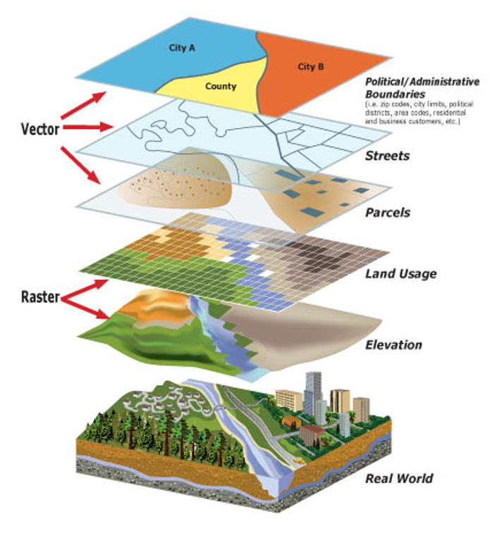

## Objectifs de la séance {#accueil}

-   Comprendre les modèles de données spatiales (vecteur vs raster) et les formats usuels (shapefile, GeoPackage, GeoJSON, CSV géocodé).
-   Maîtriser les bases de `{sf}` pour lire, transformer et croiser des données géolocalisées.
-   Produire des cartes lisibles avec `ggplot2 + geom_sf` (points, choroplèthes) et les relier à des décisions marketing.
-   Mettre en œuvre un cas réel avec BDCOM 2023 (open data APUR) et ouvrir vers d'autres open data français utiles.

## Plan global du cours

1.  Modèles de données spatiales (vecteur vs raster).
2.  Formats & sources open data (shp, gpkg, geojson, CSV géocodé).
3.  Écosystème R spatial (sf, terra, ggplot2).
4.  Construction d'objets sf (CSV → sf, shapefile → sf).
5.  CRS & reprojection (4326 vs 2154).
6.  Opérations spatiales marketing : jointures, buffers, agrégation/densité.
7.  Cartographie avec `geom_sf` (points, choroplèthes, mises en forme).
8.  Cas d'étude BDCOM 2023 & mini-projets.

## Pourquoi les cartes sont intéressantes en marketing ? {style="font-size:0.8em"}

-   Localisation = avantage compétitif : zones de chalandise, cannibalisation, “déserts commerciaux”.
-   Publicité géolocalisée (Google Ads Local, Meta, DOOH) → besoin de ciblage spatial propre.
-   Une carte = modèle mental puissant pour la décision : comprendre où agir et où se retirer.

:::::: columns
::: {.column width="50%"}
**Exemples**

-   Concentration de fast-food vs boulangeries.
-   Sous-équipement en services de santé.
-   Performance locale d'une campagne.
:::

:::: {.column width="50%"}
**2 cartes statiques utiles**

-   Densité de commerces BDCOM par IRIS/arrondissement.
-   Densité de population ou revenu médian (INSEE) pour contextualiser.

::: callout-note
### IRIS (INSEE)

**I**lots **R**egroupés pour l'**I**nformation **S**tatistique : petites zones infra-communales (≈ 2 000 habitants) utilisées pour publier des données socio-démographiques fines (revenu, âge, etc.).
:::
::::
::::::

## Pré-requis & outils

-   R ≥ 4.x, RStudio/Posit.
-   Packages clés : `sf`, `terra`, `ggplot2`, `dplyr`, `readr`.
-   Projet structuré (chemins relatifs) : `data_full/bbdcom2023/` contient BDCOM 2023.
-   QGIS/ArcGIS mentionnés pour contexte, mais focus sur R.

## Préparation : packages & environnement R {style="font-size:0.5em"}

```{r}
#| label: setup
#| echo: true
#| eval: true

library(tidyverse)
library(sf)
library(terra)
library(units)
library(glue)
library(ggrepel)
library(scales)
library(arrow)
library(knitr)

# Options globales
options(
  sf_use_s2 = FALSE,     # simplifie les calculs de distance/superficie pour l'exemple
  pillar.sigfig = 3
)

# Thème ggplot pour le cours
theme_cours4 <- theme_minimal(base_size = 14) +
  theme(
    plot.title = element_text(face = "bold", hjust = 0.5, size = rel(1.2)),
    plot.subtitle = element_text(hjust = 0.5, size = rel(1.05)),
    axis.title = element_text(face = "italic", size = rel(1.1)),
    legend.position = "bottom",
    panel.grid.minor = element_blank(),
    plot.background = element_rect(fill = "#F8F9FA", color = NA),
    panel.background = element_rect(fill = "#F8F9FA", color = NA)
  )

bpe_data <- read_csv2("../data_full/base_permanente_equipements/BPE24_varmod.csv")
bpe24_parquet <- read_parquet("../data_full/base_permanente_equipements/BPE24.parquet")
```

-   `sf` pour les vecteurs, `terra` pour les rasters.
-   `units` pour manipuler proprement mètres / km / km².
-   On désactive S2 pour rester en métrique simple (Lambert 93) dans ce cours.

# Partie 1 : comprendre les données spatiales {#partie1}

## Deux grandes familles de données spatiales 1/2 {style="font-size:0.8em"} 

Pour faire une carte en R (ou ailleurs), on manipule toujours **deux grandes familles** :

::::: columns
::: {.column width="50%"}
### 1) Les entités (*vecteur*)

Ce sont les **objets** que l'on veut représenter :

-   magasins, restaurants, pharmacies\
-   communes, départements, pays\
-   lignes de métro, routes\
-   rivières, fleuves, frontières

Chaque entité =\
**attributs** (données classiques) + **géométrie** (comment la dessiner).
:::

::: {.column width="50%"}
### 2) Les grilles (*raster*)

Ce sont des **images géoréférencées** :

-   température, pollution\
-   densité de population\
-   “chaleur” urbaine, altitude\
-   temps de trajet (isochrones converties en raster)

Chaque pixel = 1 valeur sur une zone carrée.
:::
:::::

\
\

::: callout-tip
### L'utilisation en marketing

En marketing, vous utiliserez **90% du temps des données vecteur** (points, lignes, polygones) et parfois des rasters pour la **contexte** (densité, accessibilité).
:::

## Vecteur vs raster : vue d'ensemble 2/2 {style="font-size:0.9em"}

::::: columns
::: {.column width="40%"}
-   En bas : **le monde réel** (relief, bâtiments, rivière…).
-   Au-dessus : des **couches raster**\
    (élévation, usage du sol) → grille de pixels.
-   Tout en haut : des **couches vecteur**\
    (limites admin, rues, parcelles) → objets discrets.

En pratique :

-   données de **commerces / clients / IRIS** = *vecteur*
-   des fonds comme **élévation, température, densité** = *raster*.
:::

::: {.column width="60%"}
{fig-cap="Empilement de couches raster et vecteur à partir du monde réel." fig-alt="Schéma en couches montrant le monde réel, puis des rasters (élévation, usage du sol) et des vecteurs (parcelles, rues, limites administratives)." fig-align="center" width="80%"}
:::
:::::

## À quoi ressemble une “entité” géographique ? {style="font-size:0.8em"}

Prenons une commune (polygone) ou un commerce (point).

**Bloc 1 - Attributs (comme un Excel)**

| id_entite | nom            | type           | population | CA_moyen |
|:----------|:---------------|:---------------|:-----------|:---------|
| 1         | Paris 15e      | arrondissement | 238000     | NA       |
| 2         | Monoprix Vaug. | commerce       | NA         | 1.2 M€   |

**Bloc 2 - Géométrie**

-   Point → coordonnées (x, y)
-   Ligne → liste de points
-   Polygone → contour fermé (liste de points)

En R avec `{sf}`, ces deux blocs sont fusionnés dans un **même objet** :\
un `data.frame` + **une colonne spéciale `geometry`**.

## Types de géométries (vecteur) {style="font-size:0.8em"}

Les principaux types que vous verrez :

| Type           | Exemple                                       |
|:---------------|:----------------------------------------------|
| `POINT`        | un commerce, un client, une station           |
| `LINESTRING`   | une ligne de métro, un trajet, une rue        |
| `POLYGON`      | une commune, un IRIS, une zone de chalandise  |
| `MULTIPOLYGON` | un pays avec des îles, une région multi-zones |

::: callout-note
## En pratique, dans ce cours, ce sera surtout :

-   **Points** → BDCOM (commerces)\
-   **Polygones** → communes / arrondissements / IRIS\
-   **Lignes** → (optionnel) routes, lignes de transport
:::

## Modèle `sf` en une image mentale {style="font-size:0.9em"}

Imaginez un tableau R :

| id  | enseigne | codact | CA     | geometry             |
|:----|:---------|:-------|:-------|:---------------------|
| 1   | Monoprix | ALIM   | 1.2 M€ | `POINT (2.31 48.84)` |
| 2   | Franprix | ALIM   | 0.8 M€ | `POINT (2.29 48.86)` |

-   Les colonnes “classiques” (`enseigne`, `codact`, `CA`) se manipulent comme dans n'importe quel `tibble` (version `tidy` de `dataframe`).
-   La colonne `geometry` **suit** tout ce que l'on fait avec `dplyr` : `filter`, `mutate`, `join`…

C'est le gros intérêt du package `{sf}` : **un seul objet pour les données + la carte**.

## Données raster : quand et pourquoi ? {style="font-size:0.8em"}

Même si on ne va pas en faire beaucoup dans ce cours, c'est important de comprendre l'idée.

-   La zone d'étude est découpée en **une grille de pixels**.
-   Chaque pixel a **une valeur** :
    -   densité de population\
    -   température\
    -   temps de trajet en minutes

**Applications marketing possibles :**

-   repérer des **zones chaudes / froides** (hotspots)\
-   croiser la **densité de population** avec la **densité de commerces**\
-   visualiser un **temps d'accès** (ex : 10 min à pied depuis un magasin)

## Vecteur vs raster : qui fait quoi ? {style="font-size:0.8em"}

| Question métier | Type recommandé | Pourquoi ? |
|:-----------------------------------------|:--------------|:--------------|
| Où sont mes clients / magasins ? | **Vecteur** | des *points* précis |
| Quelle est la densité de population ici ? | **Raster** | une *valeur* par zone |
| Quelle zone couvre mon magasin à 10 min à pied ? | Vecteur ou raster | buffer (vecteur) ou temps (raster) |
| Quelles communes sont sous-équipées en pharmacies ? | Vecteur | *polygones* + indicateurs |

::: callout-tip
### Règle simple :

**Vecteur → “où sont les choses ?”**\
**Raster → “comment est l'espace partout ?”**
:::

## Ce qu'il faut absolument dans vos données géo {style="font-size:0.8em"}

Pour pouvoir faire une carte, il vous faut **3 ingrédients** :

1.  **Un identifiant**
    -   `code_insee`, `code_dep`, `iso3`, `id_iris`, etc.\
        → Pour faire les jointures avec vos données métier.
2.  **Une géométrie**
    -   `POINT`, `POLYGON`, etc. dans la colonne `geometry`\
        → Pour dessiner la carte.
3.  **Un système de coordonnées (CRS)**
    -   ex : `EPSG:4326` (WGS84, lat/lon)\
    -   ex : `EPSG:2154` (Lambert 93, mètres)\
        → Pour que **toutes les couches “tombent au même endroit”**.

Sans CRS ou avec des CRS incohérents, ça donne :

-   des polygones qui flottent au milieu de l'océan,\
-   des buffers de “500” qui font 500 degrés au lieu de 500 mètres.

## Zoom sur le CRS (système de coordonnées)  {style="font-size:0.8em"}

En pratique, retenez surtout **2 codes** pour ce cours :

| CRS        | Code EPSG | Unité  | Utilisation typique                   |
|:-----------|:----------|:-------|:--------------------------------------|
| WGS84      | 4326      | degrés | Web, API, GeoJSON, GPS                |
| Lambert 93 | 2154      | mètres | France, calculs de distance / surface |

**Règles :**

-   Pour **afficher sur le web** (Leaflet, cartes interactives) → 4326.\
-   Pour **calculer des distances / buffers / surfaces en France** → 2154.

::: callout-warning
## Erreur fréquente

Calculer un buffer de 500 sur un CRS en degrés → on obtient un “cercle” complètement absurde.\
**Toujours** convertir dans un CRS métrique avant de mesurer.
:::

## Résumé Partie 1 - à retenir

-   Une donnée spatiale, c'est **un tableau + une colonne geometry**.\
-   Les objets peuvent être des **points**, **lignes** ou **polygones**.\
-   On utilise surtout :
    -   les **points** pour les commerces / clients,
    -   les **polygones** pour les territoires (communes, IRIS…).
-   Le CRS est crucial pour :
    -   bien **superposer** les couches,
    -   faire des **calculs corrects** (distances, surfaces, buffers).


# Partie 2 - Formats géographiques : lequel, pourquoi, quand ? {#partie2}

## Les formats, c'est juste un “emballage”

Vous savez maintenant ce qui doit **se trouver à l'intérieur** :

-   un tableau d'attributs\
-   une colonne de géométrie\
-   un CRS

Les formats (Shapefile, GeoJSON, GeoPackage, CSV…) sont juste **des façons différentes de stocker la même chose**.

L'enjeu pour votre utilisation :\

- savoir **quel emballage choisir** selon le contexte (analyse R, web, administration, gros volumes…).

## Panorama des formats vecteur courants {style="font-size:0.75em"}

| Format | Extension | Type | Idée générale |
|:------------------|:-----------------|:----------------|:-----------------|
| Shapefile | `.shp` (+ .dbf, .shx, .prj…) | binaire | Ancien standard SIG, très répandu dans les administrations. |
| GeoPackage | `.gpkg` | binaire | Nouveau standard OGC, basé sur SQLite, multi-couches. |
| GeoJSON | `.geojson` | texte (JSON) | Idéal pour le web et les API. |
| FlatGeobuf | `.fgb` | binaire | Format moderne, rapide, optimisé pour le streaming. |
| GeoParquet | `.parquet` | binaire | Parquet adapté aux données géo, très efficace pour le big data. |
| CSV géocodé | `.csv` | texte | Tableau classique + colonnes `lon` / `lat`. |

On détaille les 4 formats usuels : **Shapefile, GeoPackage, GeoJSON, CSV**.


## Shapefile : le "dinosaure" toujours vivant {style="font-size:0.9em"}

::::: columns
::: {.column width="50%"}

**Caractéristiques :**

-   En réalité, ce n'est pas 1 fichier mais un **pack de fichiers** :
    -   `.shp` → géométrie\
    -   `.dbf` → attributs\
    -   `.shx` → index\
    -   `.prj` → projection\
    -   `.cpg` → encodage
-   Très répandu dans :
    -   administrations,
    -   vieux tutos,
    -   anciens SIG.

:::

::: {.column width="50%"}

**Inconvénients :**

-   noms de colonnes **tronqués** (10 caractères max),
-   limite de taille (2 Go),
-   encodages parfois casse-pieds,
-   plusieurs fichiers à gérer ensembles.

**À connaître**, car vous en rencontrerez dans les open data,\
mais pour vos propres projets → préférez **GeoPackage**.

:::
:::::

------------------------------------------------------------------------

## GeoPackage (.gpkg) : le standard moderne {style="font-size:0.9em"}

::::: columns
::: {.column width="50%"}

**Points clés :**

-   1 seul fichier, basé sur **SQLite**.
-   Peut contenir :
    -   plusieurs couches vecteur (ex : communes, arrondissements, IRIS),
    -   des rasters,
    -   des métadonnées.
-   Gère bien :
    -   les noms de colonnes,
    -   les gros volumes,
    -   les CRS, etc.

:::

::: {.column width="50%"}

**Pour ce cours :**

-   format idéal pour :
    -   stocker proprement vos données,
    -   échanger entre R / QGIS / autre SIG,
    -   garder un projet reproductible.

Si vous ne savez pas quoi choisir pour votre propre projet :\
**sauvegardez en `.gpkg`**.

:::
:::::

## GeoJSON : le format web-friendly {style="font-size:0.8em"}

::::: columns
::: {.column width="50%"}

**Idée :**

-   C'est du **JSON structuré** avec deux blocs :
    -   `geometry` → la géométrie (POINT, POLYGON…),
    -   `properties` → les attributs (nom, code, CA…).

Exemple simple :

\
\
\

``` json
{
  "type": "Feature",
  "geometry": {
    "type": "Point",
    "coordinates": [2.3522, 48.8566]
  },
  "properties": {
    "nom": "Commerce A",
    "categorie": "boulangerie"
  }
}
```
:::

::: {.column width="50%"}

### Avantages :

-   Lisible par les humains (fichier texte)
-   Parfait pour le web (API, Leaflet, Mapbox, d3.js…)
-   Très répandu dans les API open data modernes

### Inconvénients :

-   peut devenir **très lourd** pour des géométries complexes avec beaucoup de coordonnées

Pour un projet simple comme ceux de ce cours, **GeoJSON** est un bon choix.

:::
:::::
 
## CSV géocodé : le “low-tech” spatial {style="font-size:0.75em"}

Beaucoup de portails open data donnent des CSV avec :

-   soit deux colonnes `lon` et `lat`,
-   soit une colonne “Geo Point” (type `48.8566, 2.3522`).

### Exemple

| id | nom           | lon     | lat      | codact |
|----|---------------|---------|----------|--------|
| 1  | Boulangerie X | 2.3456  | 48.8612  | BOULA  |
| 2  | Pharmacie Y   | 2.3123  | 48.8579  | PHARM  |
| 3  | Restaurant Z  | 2.3788  | 48.8701  | REST   |

### Important

-   un CSV n'est **pas encore spatial** → il faut le convertir en objet `{sf}` avec `st_as_sf()` en indiquant :
    -   quelle colonne = `lon`,
    -   quelle colonne = `lat`,
    -   et quel CRS (souvent `4326`).

En gros, **le CSV est un transporteur**, `{sf}` en fait un **objet géo**.

## Formats pour gros volumes : GeoParquet & FlatGeobuf {style="font-size:0.85em"}

Vous les croisez surtout dans des workflows data science avancés :

### GeoParquet

-   Parquet + extensions géo\
-   idéal pour de très gros volumes,\
-   bien intégré avec Arrow (R/Python).

### FlatGeobuf (.fgb)

-   format binaire moderne, très rapide à lire,\
-   pratique pour diffuser des gros fichiers via le web.

Pour ce cours : **connaître les noms suffit**.\
Si un jour votre dataset géo fait plusieurs millions de lignes → pensez à ces formats.

## Quel format choisir dans quel cas ? {style="font-size:0.8em"}

### Cas typiques

-   **Je prépare un mini-projet pour le cours, avec BDCOM + IRIS**\
    → gardez vos données nettoyées en **GeoPackage**.

-   **Je veux faire une carte web interactive simple**\
    → exportez une couche simplifiée en **GeoJSON**.

-   **Je télécharge des données INSEE / IGN / APUR**\
    → vous allez souvent tomber sur du **Shapefile** → lisez-le une fois,\
    puis convertissez en `.gpkg`.
    
```{r}
#| label: shp-to-gpkg
#| eval: false
#| echo: true

st_read("chemin/mon_fichier.shp") |>
  st_write("mon_fichier.gpkg", layer = "ma_couche", delete_layer = TRUE) ## Par exemple couche "communes"
```


-   **Je récupère un CSV avec des adresses ou des coordonnées**\
    → convertissez-le en `sf` (`st_as_sf`), puis travaillez comme avec le reste.

------------------------------------------------------------------------

## Check-list “formats & structure” avant de cartographier {style="font-size:0.85em"}

Avant d'attaquer `ggplot2`, réfléchir à ces questions :

### 1) Mon fichier a-t-il une géométrie ?

-   Oui → Shapefile, GeoJSON, GPKG, GeoParquet, etc.\
-   Non → CSV → il faut le transformer en `sf`.

### 2) Ai-je un identifiant stable pour joindre mes données métier ?

-   ex : code INSEE commune, IRIS, code pays, id magasin…

### 3) Le CRS est-il renseigné et cohérent ?

-   `st_crs(objet)` doit retourner un EPSG valable.\
-   Si je croise plusieurs couches → elles doivent être **dans le même CRS**.

### Quel est mon objectif final ?

-   Carte statique pour slides → peu importe le format source, mais travaillez proprement en `sf`.\
-   Carte web → pensez **GeoJSON + WGS84 (4326)**.\
-   Analyse de distances → pensez **Lambert 93 (2154)**.


## Tableau récap des formats {style="font-size:0.9em"}

| Format | Fichier(s) | Utilisation recommandée | Ce qu'il faut retenir |
|-------------|-------------|---------------------|---------------------------|
| Shapefile | `.shp + …` | Recevoir des données d'admin / vieux SIG | Ancien, chiant, mais incontournable en open data. |
| GeoPackage | `.gpkg` | Vos projets perso / collaboratifs | **Format par défaut** pour stocker proprement. |
| GeoJSON | `.geojson` | Web, API, petites cartes interactives | Très lisible, parfait pour Leaflet / Mapbox. |
| CSV géocodé | `.csv` | Export simple depuis CRM / open data | Doit être converti en `sf` pour devenir spatial. |
| GeoParquet | `.parquet` | Très gros volumes, pipelines data science | “Big data géo”, souvent avec Arrow. |

## Partie 3 - Écosystème R spatial

-   `{sf}` : vecteur moderne (remplace `{sp}`).
-   `{terra}` : rasters (successeur de `{raster}`) + vecteurs simple.
-   `{ggplot2}` : cartographie statique avec `geom_sf`.
-   `{tmap}`, `{leaflet}` : interactif (hors périmètre ici).

::: callout-note
### Ancienne stack
`{sp}`, `{rgdal}`, `{rgeos}` est dépréciée. Restez sur `{sf}` / `{terra}`.
:::


## R & SIG bureautiques

-   R comme moteur d'analyse/automation.
-   QGIS / ArcGIS pour édition manuelle, rendu avancé.
-   Interopérabilité via GeoPackage ou GeoJSON.


## Ressources de référence (sélection)

- Caroline Engel – *R-Spatial*  
  <https://cengel.github.io/R-spatial/>

- *Geocomputation with R*  
  <https://r.geocompx.org/>

- Moraga – *Spatial Data Science*  
  <https://www.paulamoraga.com/book-spatial/>

- Paez – *Spatial Analysis in R*  
  <https://paezha.github.io/spatial-analysis-r/>

- *GDS Applications – Duke University*  
  <https://ryan-lab-duke.github.io/gds-applications-site/intro.html>

- *Spatial Data Analysis and Visualization in R* (scripts & tutoriels)  
  <https://github.com/rajikudusadewale/Spatial-Data-Analysis>


## Partie 4 - Construire ses premiers objets sf {style="font-size:0.7em"}
### De CSV lon/lat → sf

```{r}
#| label: csv-to-sf
#| warning: false
#| message: false

clients_tbl <- tibble(
  client_id = 1:5,
  lon = c(2.34, 2.28, 2.36, 2.30, 2.32),
  lat = c(48.86, 48.85, 48.84, 48.88, 48.83),
  panier_moyen = c(45, 52, 39, 61, 48)
)

clients_sf <- st_as_sf(
  clients_tbl,
  coords = c("lon", "lat"),
  crs = 4326
)

clients_sf
```

-   `coords = c("lon","lat")` + `crs = 4326` (WGS84) créent la colonne `geometry`.


## Lire un geojson (BDCOM 2023) {style="font-size:0.7em"}

::::: columns
::: {.column width="55%"}

```{r}
#| label: load-bdcom

bdcom_sf <- st_read("../data_full/bbdcom2023/BDCOM_2023.geojson", quiet = TRUE)

glimpse(bdcom_sf)
```
:::

::: {.column width="45%"}
### Explication du code

- `st_read()` lit directement un fichier **GeoJSON** et le convertit en objet `{sf}`.
- Le résultat est un **tableau** classique (data.frame / tibble) avec une colonne spéciale `geometry`.
- `glimpse()` affiche :
  - le **nombre de lignes** (≈ 60 000 commerces),
  - le **nombre de colonnes** (≈ 23 attributs métier),
  - les **types** de chaque champ (`int`, `chr`, `dbl`, etc.),
  - le **CRS** associé (ici : Lambert 93 - *EPSG:2154*),
  - la **géométrie** : des `POINT` correspondant aux coordonnées des commerces.
- L'objet `bdcom_sf` peut ensuite être manipulé comme n'importe quel tibble :  
  `select()`, `filter()`, `mutate()`, mais **la géométrie suit automatiquement**.
- Le CRS étant en **mètres** (2154), il est adapté pour :
  - calculer des distances,
  - faire des buffers,
  - réaliser des agrégations spatiales fiables.

:::
::::

## Inspecter les données BDCOM

```{r}
#| label: inspect-bdcom
#| warning: false
#| message: false

bdcom_sf %>%
  as_tibble() %>%
  select(arro, codact, ens, surf, geometry) %>%
  slice_head(n = 6)
```

-   Vérifiez l'encodage des champs texte (`ens`, `lib_voie`).
-   `arro` = numéro d'arrondissement (utile pour agrégations rapides).


## Export rapide en GeoPackage

```{r}
#| label: write-bdcom-gpkg
#| warning: false
#| message: false
#| eval: false

st_write(
  bdcom_sf,
  "data_full/bbdcom2023/bdcom_2023.gpkg",
  layer = "bdcom_2023",
  delete_layer = TRUE
)
```

## Partie 5 - Systèmes de coordonnées (CRS)

-   **EPSG:4326** : latitude/longitude (degrés). Idéal web/API.
-   **EPSG:2154 (Lambert 93)** : mètres. Idéal pour distances/surfaces en France.
-   Toujours vérifier avant de croiser des données.


## Vérifier et transformer un CRS

::::: columns
::: {.column width="50%"}

### 1) Vérifier le CRS d’origine  

```{r}
#| label: check-crs

st_crs(bdcom_sf)

```

:::
::: {.column width="50%"}

### 2) Transformer en CRS métrique  

```{r}
#| label: transform-crs
bdcom_l93 <- st_transform(bdcom_sf, 2154)
st_crs(bdcom_l93)
```


:::
::::


### Pourquoi transformer en Lambert 93 ?

- EPSG:4326 → **degrés**, bon pour afficher  
- EPSG:2154 → **mètres**, indispensable pour buffers / distances / surfaces  

📌 **Règle d’or** : toujours se mettre en mètres avant de mesurer.


## Quel CRS choisir pour son analyse ? {style="font-size:0.7em"}

Il ne s'agit pas de connaître les codes par cœur, mais de savoir quel système utiliser pour quelle question business.

| Question business | Système recommandé | Code EPSG | Unité |
|:----------------|:----------------|:------------------:|:----------------|
| *"je veux afficher des points sur une carte web interactive (Leaflet)"* | **WGS 84** (GPS mondial) | `4326` | degrés (lon/lat) |
| *"je veux calculer des distances de livraison ou des surfaces de magasins en France"* | **Lambert 93** (projection France) | `2154` | mètres |
| *"je veux comparer des pays à l'échelle mondiale"* | **Robinson / Mollweide** | varie | mètres (compromis) |

::: callout-warning
### Erreur classique : calculer un buffer de "500" sur des données en WGS84 (degrés).
R va faire un cercle de 500 degrés (soit plus que la Terre !).
**Toujours convertir en Lambert 93 avant de mesurer.**
:::

# Partie 6 - Opérations spatiales de base

## Le vocabulaire des interactions spatiales {style="font-size:0.9em"}

Pour croiser vos données, il faut choisir le bon verbe spatial.

| Verbe | Signification | Exemple question business |
|:-----------------------|:-----------------------|:-----------------------|
| **st_intersects** | est-ce que ça touche ? | un client est-il dans ma zone (ou sur la bordure) ? |
| **st_within** | est-ce que c'est dedans ? | quels commerces sont strictement à l'intérieur du 11ᵉ arr. ? |
| **st_contains** | est-ce que ça contient ? | quel département contient le plus de magasins ? |
| **st_touches** | est-ce que ça frôle ? | quels sont les départements limitrophes de l'Île-de-France ? |

## Jointure spatiale (points → zones) {style="font-size:0.6em"}

Même sans polygones IRIS, on peut illustrer avec un maillage régulier (grid).

```{r}
#| label: grid-build
#| fig-alt: "Grille carrée couvrant l'emprise des points BDCOM"
#| output-location: slide
#| fig-width: 10
#| fig-height: 8
#| fig-align: center

# Données en Lambert-93 (mètres)
bdcom_l93 <- st_transform(bdcom_sf, 2154)

# Grille régulière
grid_paris <- st_make_grid(bdcom_l93, cellsize = 750, square = TRUE) |>
  st_as_sf()

# Carte (on reste en 2154 → carte parfaitement droite)
ggplot() +
  geom_sf(data = grid_paris, fill = NA, color = "grey60", linewidth = 0.1) +
  geom_sf(data = bdcom_l93, color = "#1f77b4", size = 0.05, alpha = 0.4) + # petits points car beaucoup de données pour une petite zone comme Paris
  theme_cours4 +
  labs(title = "BDCOM 2023 : points + grille régulière (750 m)")
```

## Compter les commerces par cellule (grid) {style="font-size:0.7em"}

```{r}
#| label: grid-counts
#| warning: false
#| message: false
#| fig-width: 10
#| fig-height: 8
#| fig-align: center
#| fig-alt: "Carte choroplèthe sur grille régulière montrant les densités de commerces"
#| output-location: slide

# Grille plus fine : 200 m
grid_paris_l93 <- st_make_grid(
  st_as_sfc(st_bbox(bdcom_l93)),
  cellsize = 200,   # <-- cellules de 200 m
  square   = TRUE
) |>
  st_as_sf() |>
  mutate(id = row_number())

# Conversion en WGS84 pour garder en 4326
grid_paris <- st_transform(grid_paris_l93, 4326)

# Comptage
grid_counts <- grid_paris |>
  mutate(nb_commerces = lengths(st_intersects(grid_paris, bdcom_sf)))

ggplot(grid_counts) +
  geom_sf(aes(fill = nb_commerces), color = NA) +
  scale_fill_viridis_c(
    option = "plasma",
    trans = "sqrt"   # Transformation racine : réduit l'écrasement visuel des valeurs hautes 
                     # (les cellules très denses ne dominent plus la palette) 
                     # → meilleure lisibilité des zones faiblement/moyennement denses
  ) +
  coord_sf() +
  theme_cours4 +
  labs(
    title = "Densité de commerces (approx.)",
    subtitle = "Comptage par cellule de 200 m",
    fill = "Nombre de\ncommerces"
  ) +
  theme(
    legend.key.width = unit(2, "cm"),
    legend.text = element_text(size = 9)
  )
```

-   Approche robuste avec données locales uniquement.
-   Remplacez `grid_paris` par un shapefile IRIS dès que disponible pour une carte métier.

## Version Raster : comptage de commerces par pixel {style="font-size:0.5em"}

::::columns
::: {.column width="50%"}

```{r}
#| label: raster-counts
#| fig-align: center
#| fig-alt: "Carte raster montrant la densité de commerces par pixel"
#| fig-width: 7
#| fig-height: 5

library(terra)

# Raster vide (résolution 200 m)
r <- rast(ext(bdcom_l93), resolution = 200)

# Rasterisation : nombre de points par pixel
r_count <- rasterize(
  vect(bdcom_l93),
  r,
  fun = "count",
  background = 0
)

# Carte raster
plot(
  r_count,
  col = hcl.colors(20, "Inferno"),
  main = "Densité de commerces (raster 200 m)"
)
```

:::
::: {.column width="50%"}

### Ce que change la version *raster*

- Ici, Paris est converti en une **matrice régulière de pixels**  
  (chaque pixel = 200 m × 200 m en Lambert-93).
- Chaque pixel contient **une seule valeur numérique** :  
  _le nombre de commerces tombant dans ce pixel_.

### Différences clés vs la version précédente (vectorielle)

| Grille SF (vectorielle)                  | Raster                                        |
|------------------------------------------|-----------------------------------------------|
| chaque cellule = *polygone sf*           | chaque cellule = *pixel* dans une matrice     |
| géométrie exacte (formes, contours)      | géométrie simplifiée (grille fixe)            |
| calcul spatial précis                    | très rapide, idéal pour heatmaps              |
| visuel “pixelisé” si cellsize faible     | visuel raster natif                           |

### Pourquoi montrer les deux ?

- pour comprendre **deux familles d’objets spatiaux**  
- pour voir que “densité” peut se calculer **en vectoriel** ou **en raster**  
- utile pour :  
  - l’analyse spatiale avancée  
  - les outils SIG (QGIS, ArcGIS)  
  - le machine learning géospatial (KDE, CNN sur raster)

:::
:::

## Jointure spatiale point-in-polygon (concept) {style="font-size:0.7em"}

```{r}
#| label: join-concept
#| eval: true
#| echo: true

# 1. Charger les IRIS depuis le GeoJSON (chemin relatif depuis cours_4/)
iris <- st_read("../data_full/iris/iris.geojson", quiet = TRUE) |>
  st_transform(2154)   # reprojection en mètres (Lambert-93)

# 2. Ne garder que Paris (département 75)
iris_paris <- iris |>
  filter(dep == "75")   # colonne 'dep' (minuscule)

# 3. Reprojeter aussi les commerces en 2154
bdcom_l93 <- st_transform(bdcom_sf, 2154)

# 4. Jointure spatiale point-in-polygon :
#    chaque commerce hérite du code_iris dans lequel il se trouve
bdcom_iris <- st_join(bdcom_l93, iris_paris)

# 5. Comptage de commerces par IRIS
comptage_iris <- bdcom_iris |>
  st_drop_geometry() |>
  count(code_iris, name = "nb_commerces")
```

- `st_join()` duplique les lignes de `bdcom_sf` en ajoutant les attributs du polygone intersecté (ici : l’IRIS).
- Vérifiez toujours que les CRS correspondent (`st_crs()`), sinon la jointure spatiale sera fausse.
- Des points peuvent rester sans correspondance (valeurs `NA`) s’ils sont hors des polygones.

## Voir les données jointes {style="font-size:0.5em"}

:::: columns
::: column


```{r}
#| label: view-joined-data
#| eval: true

bdcom_iris |>
  st_drop_geometry() |>
  select(ens, lib_voie, nom_com, nom_iris, code_iris) |>
  slice_head(n = 8) |>
  kable(
    caption = "Exemple de jointure : chaque commerce est rattaché à un IRIS"
  )
```

:::
::: column

**Qu’est-ce qu’on a fait avec `st_join()` ?**

- On part d’une base de **points** : chaque ligne représente un commerce BDCOM (enseigne, adresse, coordonnées XY…).
- On joint les **polygones IRIS** (quartiers INSEE) grâce à une jointure spatiale *point-in-polygon*.
- Chaque commerce récupère automatiquement les attributs du quartier dans lequel il se trouve :
  - `code_iris` → identifiant officiel du quartier statistique  
  - `nom_iris` → nom du quartier (ex. *Les Halles 5*, *Palais Royal 1*, etc.)

**Ce que ça débloque par rapport à avant**

- On peut maintenant **agréger par IRIS** :
  - nombre de commerces par quartier  
  - nombre de commerces d'une enseigne spécifique  
- On peut **croiser avec les données INSEE 2022** (population, âge, revenus, catégories socio-pro…) qui utilisent aussi `code_iris`.
- On passe d’une carte de **points** (peu lisible en centre-ville) à des cartes de **quartiers** → très adaptées au géomarketing :
  - détecter les zones **sous-équipées** ou **surdenses**
  - analyser la correspondance entre **offre** et **demande**  
  - réaliser des **études d’implantation**, de ciblage ou de segmentation territoriale

:::
:::::

## On joint les données FILOSOFI de l'INSEE {style="font-size:0.7em"}

```{r}
#| label: join-filosofi

# 1. Charger FILOSOFI communes
filo_com <- read_csv2(
  "../data_full/filosofi/FILO2021_DISP_COM.csv"
)

# Garder quelques variables simples et Paris uniquement (codes qui commencent par 75)
filo_paris <- filo_com |>
  dplyr::filter(stringr::str_starts(CODGEO, "75")) |>
  dplyr::select(
    CODGEO,        # code commune (arrondissement à Paris)
    NBMEN21,       # nb de ménages
    NBPERS21,      # nb de personnes
    NBUC21,        # nb d'unités de consommation (volume)
    Q221,          # médiane du niveau de vie (revenu dispo par UC)
    GI21,          # indice de Gini (inégalités)
    S80S2021,      # rapport S80/S20 (inégalités)
    PCHO21,        # indicateur lié au chômage (à vérifier dans la doc)
    PPFAM21,       # indicateur "familles" (structure des ménages)
    PPMINI21       # indicateur de minima sociaux / fragilité (à vérifier)
  )

# 2. Agréger les IRIS au niveau "commune" (arrondissement)
iris_com_sf <- iris_paris |>
  group_by(insee_com, nom_com) |>
  summarise(geometry = st_union(geometry), .groups = "drop") |>
  mutate(CODGEO = as.character(insee_com))

# 3. Compter les commerces par commune directement depuis bdcom_iris
comptage_com <- bdcom_iris |>
  st_drop_geometry() |>
  group_by(dep, insee_com, nom_com) |>
  summarise(nb_commerces = n(), .groups = "drop") |>
  mutate(CODGEO = as.character(insee_com))

# 4. Joindre tout : géométrie + FILOSOFI + nb de commerces
paris_marketing <- iris_com_sf |>
  dplyr::left_join(filo_paris,  by = "CODGEO") |>
  dplyr::left_join(
    comptage_com |> dplyr::select(CODGEO, nb_commerces),
    by = "CODGEO"
  ) |>
  dplyr::mutate(
    nb_commerces = tidyr::replace_na(nb_commerces, 0),
    NBPERS21     = readr::parse_double(NBPERS21),
    commerces_par_1000 = 1000 * nb_commerces / NBPERS21,
    revenu_median = readr::parse_double(Q221,
      locale = readr::locale(decimal_mark = ",")
    ),
    gini   = readr::parse_double(GI21,
      locale = readr::locale(decimal_mark = ",")
    ),
    s80s20 = readr::parse_double(S80S2021,
      locale = readr::locale(decimal_mark = ",")
    ),
    p_chomage = readr::parse_double(PCHO21,
      locale = readr::locale(decimal_mark = ",")
    ),
    p_familles = readr::parse_double(PPFAM21,
      locale = readr::locale(decimal_mark = ",")
    ),
    p_minima = readr::parse_double(PPMINI21,
      locale = readr::locale(decimal_mark = ",")
    ),
    # ---- numéros d'arrondissements ----
    num_arr = as.integer(substr(CODGEO, 4, 5)),
    lab_arr = dplyr::if_else(num_arr == 1, "1er", paste0(num_arr, "e"))
  )

library(showtext)
font_add_google("Crimson Pro", "crimson")
showtext_auto()

# Objet dédié pour les labels (centroïdes internes + couleurs)
paris_marketing_centres <- paris_marketing |>
  dplyr::mutate(
    # pour Gini / revenu : texte blanc sur les quartiers sombres
    col_label     = ifelse(gini <= 0.45, "white", "grey15"),
    # pour la densité de commerces : tout blanc sauf 1er arr.
    col_label_com = ifelse(num_arr == 1, "grey15", "white"),
    geometry      = sf::st_point_on_surface(geometry)
  )

glimpse(paris_marketing)

```

## Revenu médian par arrondissement {style="font-size:0.7em"}
### Où sont les quartiers solvables ?

\

```{r}
#| label: map-revenu
#| fig-align: center
#| out-width: 100%
#| out-height: 90%
#| output-location: slide

ggplot(paris_marketing) +
  geom_sf(aes(fill = revenu_median), color = "white") +
  geom_sf_text(
    data = paris_marketing_centres,
    aes(label = lab_arr, color = col_label),
    size = 3.8,
    fontface = "bold"
  ) +
  scale_color_identity() +
  scale_fill_viridis_c(
    option = "magma",
    name   = "Revenu médian\n€/UC"
  ) +
  theme_cours4 +
  theme(
    text = element_text(family = "crimson"),
    legend.position   = "bottom",
    legend.key.height = unit(0.7, "cm"),
    legend.key.width  = unit(2, "cm")
  ) +
  labs(
    title    = "Niveau de vie médian par arrondissement",
    subtitle = "Filosofi 2021 - revenu disponible par unité de consommation",
    x = NULL, y = NULL
  )


```

## Inégalités de revenu (indice Gini) {style="font-size:0.8em"}

```{r}
#| label: map-gini
#| fig-align: center
#| out-width: 100%
#| out-height: 90%
#| output-location: slide

ggplot(paris_marketing) +
  geom_sf(aes(fill = gini), color = "white") +
  geom_sf_text(
    data = paris_marketing_centres,
    aes(label = lab_arr, color = col_label),
    size = 3.8, fontface = "bold"
  ) +
  scale_color_identity() +
  scale_fill_viridis_c(option = "plasma", name = "Indice de Gini") +
  theme_cours4 +
  theme(
    text = element_text(family = "crimson"),
    legend.position   = "bottom",
    legend.key.width  = unit(2,   "cm"),
    legend.key.height = unit(1.5, "cm")
  ) +
  labs(
    title    = "Inégalités de revenu par arrondissement",
    subtitle = "Plus la valeur est élevée, plus le quartier est socialement hétérogène",
    x = NULL, y = NULL
  )


```

## Typologie marketing simple {style="font-size:0.7em"}
### Où ouvrir un nouveau commerce ?

```{r}
#| label: map-typologie
#| fig-align: center
#| out-width: 100%
#| out-height: 90%
#| output-location: slide

paris_typo <- paris_marketing |>
  dplyr::mutate(
    cat_revenu = dplyr::ntile(revenu_median, 3),
    cat_dens   = dplyr::ntile(commerces_par_1000, 3),
    segment = dplyr::case_when(
      cat_revenu == 3 & cat_dens == 3 ~ "Riche & hyper-commerçant",
      cat_revenu == 3 & cat_dens == 1 ~ "Riche mais peu commerçant",
      cat_revenu == 1 & cat_dens == 3 ~ "Populaire mais très commerçant",
      cat_revenu == 1 & cat_dens == 1 ~ "Populaire & peu commerçant",
      TRUE ~ "Profil intermédiaire"
    )
  )

ggplot(paris_typo) +
  geom_sf(aes(fill = segment), color = "white") +
  geom_sf_text(
    data = paris_marketing_centres,
    aes(label = lab_arr),
    size  = 3,
    color = "grey20"
  ) +
  scale_fill_brewer(palette = "Set2", name = "Segment") +
  theme_cours4 +
  theme(
    legend.text  = element_text(size = 7),
    legend.title = element_text(size = 8)
  ) +
  labs(
    title    = "Typologie marketing des arrondissements",
    subtitle = "Croisement niveau de vie médian × densité de commerces",
    x = NULL, y = NULL
  )
```

## Analyser la couverture commerciale par arrondissement {style="font-size:0.7em"}

```{r}
#| label: map-filosofi
#| fig-align: center
#| out-width: 100%
#| out-height: 90%
#| output-location: slide

ggplot(paris_marketing) +
  geom_sf(aes(fill = commerces_par_1000), color = "white") +
  geom_sf_text(
    data = paris_marketing_centres,
    aes(label = lab_arr, color = col_label_com),
    size = 3.8, fontface = "bold"
  ) +
  scale_color_identity() +
  scale_fill_viridis_c(
    option = "plasma",
    trans  = "sqrt",
    name   = "Commerces\npour 1 000 hab."
  ) +
  theme_cours4 +
  theme(
    text = element_text(family = "crimson"),
    legend.position   = "bottom",
    legend.key.height = unit(1.5, "cm"),
    legend.key.width  = unit(2, "cm")
  ) +
  labs(
    title    = "Densité de commerces par arrondissement",
    subtitle = "BDCOM 2023 × FILOSOFI 2021 (population)",
    x = NULL, y = NULL
  )


```

## Revenu médian vs densité de commerces {style="font-size:0.7em"}

```{r}
#| label: scatter-filosofi-smooth
#| fig-align: center
#| out-width: 100%
#| out-height: 90%
#| output-location: slide

pm <- paris_marketing |>
  dplyr::mutate(
    revenu_median = readr::parse_double(
      Q221,
      locale = readr::locale(decimal_mark = ",")
    )
  )

ggplot(pm, aes(x = revenu_median, y = commerces_par_1000)) +
  geom_point(color = "#1f77b4", size = 2) +
  geom_smooth(method = "lm", se = TRUE, color = "#e76f51") +
  ggrepel::geom_text_repel(aes(label = nom_com), size = 3) +
  theme_cours4 +
  labs(
    title    = "Revenu médian vs densité de commerces",
    subtitle = "Chaque point = un arrondissement de Paris",
    x        = "Revenu disponible médian par UC (euros)",
    y        = "Commerces pour 1 000 habitants"
  )


```

## Zone de chalandise : vue globale vs zoom {style="font-size:0.7em"}

```{r}
#| label: buffer-compare
#| echo: true
#| out-width: 100%
#| out-height: 90%
#| fig-align: center
#| output-location: slide

# Données en Lambert-93
bdcom_l93 <- st_transform(bdcom_sf, 2154)

set.seed(123)
un_commerce <- bdcom_l93 |> slice_sample(n = 1)

# Buffer de 500 m
zone_500m <- st_buffer(un_commerce, dist = 500)

# Commerces dans / hors zone
voisins <- bdcom_l93[zone_500m, ]
hors_voisins <- bdcom_l93[!st_intersects(bdcom_l93, zone_500m, sparse = FALSE), ]

# ---- 1) Vue globale : tous les commerces + buffer ----
p_global <- ggplot() +
  geom_sf(data = hors_voisins, color = "grey80", size = 0.3, alpha = 0.5) +
  geom_sf(data = voisins,      color = "#ef476f", size = 0.2, alpha = 0.8) +
  geom_sf(data = zone_500m,    fill  = "#ffd16640", color = "#ffa600") +
  geom_sf(data = un_commerce,  color = "black", size = 2) +
  theme_cours4 +
  labs(
    title = "Vue globale",
    subtitle = glue("Commerces voisins : {nrow(voisins)}")
  )

# ---- 2) Zoom sur la zone de 500 m uniquement ----
p_zoom <- ggplot() +
  geom_sf(data = zone_500m, fill = "#ffd16655", color = "#ffa600") +
  geom_sf(data = voisins,   color = "#ef476f", size = 0.7, alpha = 0.8) +
  geom_sf(data = un_commerce, color = "black", size = 2) +
  coord_sf(
    xlim = st_bbox(zone_500m)[c("xmin","xmax")],
    ylim = st_bbox(zone_500m)[c("ymin","ymax")]
  ) +
  theme_cours4 +
  theme(
    axis.text   = element_blank(),  # enlève les labels (2.286°E etc.)
    axis.ticks  = element_blank(),  # enlève les graduations
    axis.title  = element_blank()   # enlève "x" et "y" éventuels
  ) +
  labs(
    title    = "Zoom sur la zone de 500 m",
    subtitle = "Commerces à l'intérieur du buffer"
  )

p_global


```

-   Idéal pour estimer concurrence locale ou couverture d'un point de vente.
-   Rappel : buffer en mètres → rester en Lambert 93 (EPSG:2154).

## Zoom sur la zone de chalandise

```{r}
#| label: buffer-compare-zoom
#| out-width: 100%
#| out-height: 90%
#| fig-align: center
#| echo: false
p_zoom
```


## Règles d'or pour ne pas se perdre

-   Toujours vérifier le CRS avant un join ou un buffer.
-   Vérifier le type de géométrie (`st_geometry_type`).
-   Contrôler les unités (m vs degrés) pour les distances/surfaces.
-   Vérifier le nombre de lignes avant/après jointures/agrégations.


## Comparer deux catégories de commerces {style="font-size:0.6em"}

```{r}
#| label: carte-comparaison
#| out-width: 80%
#| out-height: 80%
#| fig-align: center
#| fig-width: 8
#| fig-height: 6
#| output-location: slide
#| fig-cap: "Comparaison visuelle de deux catégories d'activité"
#| fig-alt: "Deux cartes de points pour deux codes d'activité"

top_codact <- bdcom_sf %>%
  st_drop_geometry() %>%
  count(codact, sort = TRUE) %>%
  slice_head(n = 2) %>%
  pull(codact)

bdcom_top <- bdcom_sf %>% filter(codact %in% top_codact)

ggplot(bdcom_top) +
  geom_sf(aes(color = codact), alpha = 0.6, size = 0.5) +
  scale_color_brewer(palette = "Set1") +
  coord_sf() +
  theme_cours4 +
  labs(
    title = "Deux catégories majeures dans BDCOM",
    subtitle = "Sélection automatique des 2 codes activité les plus fréquents",
    color = "Code activité"
  )
```

-   Adapter aux catégories métier (boulangeries, restauration rapide, pharmacies…) après inspection des codes.

## Cartes interactives (leaflet / plotly)


```{r}
#| label: leaflet-bdcom
#| eval: true
#| echo: true
#| output-location: slide

library(leaflet)
bdcom_sample <- bdcom_sf %>%
  slice_sample(n = 200) %>%
  st_transform(4326)

leaflet(bdcom_sample) |>
  addTiles() |>
  addCircleMarkers(
    radius = 4,
    stroke = FALSE,
    fillOpacity = 0.6,
    popup = ~glue("{ens}<br>Code: {codact}")
  )
```

```{r}
#| label: plotly-bdcom
#| eval: true
#| echo: true
#| output-location: slide

leaflet(bdcom_sample) %>%
  addTiles() %>%  # Fond de carte OpenStreetMap
  addCircleMarkers(
    radius = 6,
    fillColor = "#1f78b4",
    fillOpacity = 0.7,
    color = "#1f78b4",
    weight = 2,
    label = ~ens,
    popup = ~paste0(
      "<b>", ens, "</b><br>",
      "Code activité: ", codact, "<br>",
      "Adresse: ", num, " ", typ_voie, " ", lib_voie
    )
  )
```


## Choroplèthe “style Lego” (inspiré d'un tuto R) {style="font-size:0.8em"}

::::: columns
::: {.column width="55%"}
```{r}
#| label: lego-choropleth
#| eval: true
#| echo: true
#| fig-align: center
#| out-width: 100%
#| out-height: 100%
#| fig-alt: "Carte en briques stylisées"
#| output-location: slide

# Données (exemple depuis un GPKG en ligne)
map <- read_sf("https://github.com/BjnNowak/lego_map/raw/main/data/france_sport.gpkg")

# Classes sur la variable 'value'
clean <- map %>%
  mutate(clss = case_when(
    value < 18 ~ "1",
    value < 20 ~ "2",
    value < 22 ~ "3",
    value < 24 ~ "4",
    value < 26 ~ "5",
    TRUE       ~ "6"
  ))

pal <- c("#bb3e03", "#ee9b00", "#e9d8a6", "#94d2bd", "#0a9396", "#005f73")
bck <- "#001219"

theme_custom <- theme_void() +
  theme(
    plot.margin      = margin(1, 1, 10, 1, "pt"),
    plot.background  = element_rect(fill = bck, color = NA),
    legend.position  = "bottom",
    legend.title     = element_text(hjust = 0.5, color = "white", face = "bold"),
    legend.text      = element_text(color = "white")
  )

# Grille + centroids (briques)
grd <- st_make_grid(clean, n = c(60, 60)) |>
  st_sf() |>
  mutate(id = row_number())

cent <- st_centroid(grd)
cent_clean <- st_intersection(cent, clean)

grd_clean <- grd |>
  left_join(st_drop_geometry(cent_clean), by = "id")

ggplot() +
  geom_sf(
    data = grd_clean %>% drop_na(),
    aes(fill = clss)
  ) +
  geom_sf(
    data  = cent_clean,
    color = alpha("black", 0.5),
    size  = 0.5
  ) +
  labs(fill = "Sport") +
  guides(
    fill = guide_legend(
      nrow           = 1,
      title.position = "top",
      label.position = "bottom"
    )
  ) +
  scale_fill_manual(
    values = pal,
    labels = c("< 18 %", "< 20 %", "< 22 %", "< 24 %", "< 26 %", "≥ 26 %")
  ) +
  theme_custom
```
:::

::: {.column width="45%"}
-   Démo artistique : classes + grille + centroids façon “briques”.
-   Le lien source utilise des données Observatoire des Territoires (sport par département).
-   Adaptez :
    -   la variable (`value` ici),
    -   la résolution de la grille (`n = c(60,60)`),
    -   la palette (`pal`) et le fond (`bck`)..
-   source : https://r-graph-gallery.com/web-choropleth-map-lego-style.html
:::
:::::

## Carte interactive de la France {style="font-size:0.6em"}

Cette visualisation combine :

- **Régions** (couleurs distinctes)
- **Départements** (contours fins + tooltips)
- **Zoom & Pan** grâce à `ggiraph`
- Données NUTS 2024 (`giscoR`)

```{r}
#| label: interactive-france
#| output-location: slide
#| fig-width: 14
#| fig-height: 9

library(giscoR)
library(ggiraph)
library(janitor)

my_palette <- c("#e41a1c", "#377eb8", "#4daf4a", "#984ea3", "#ff7f00", "#ffff33", 
                "#a65628", "#f781bf", "#999999", "#66c2a5", "#fc8d62", "#8da0cb",
                "#e78ac3", "#a6d854", "#ffd92f", "#e5c494", "#b3b3b3", "#1f78b4",
                "#33a02c", "#fb9a99", "#fdbf6f", "#cab2d6", "#6a3d9a", "#ffff99",
                "#b15928", "#ffed6f", "#b2df8a", "#fbb4ae")

# Départements
france_departments <- gisco_get_nuts(
  country = "France", nuts_level = 3, year = 2024, epsg = 3035
) %>%
  as_tibble() %>%
  clean_names() %>%
  filter(!nuts_id %in% c("FRY10","FRY20","FRY30","FRY40","FRY50"))

# Régions
france_regions <- gisco_get_nuts(
  country = "France", nuts_level = 2, year = 2024, epsg = 3035
) %>%
  as_tibble() %>%
  clean_names() %>%
  filter(!nuts_id %in% c("FRY1","FRY2","FRY3","FRY4","FRY5"))

# Plot interactif
plot <- france_regions %>%
  ggplot(aes(geometry = geometry)) +
  geom_sf(aes(fill = nuts_name), color = "black", linewidth = 0.5) +
  geom_sf_interactive(
    data = france_departments,
    aes(data_id = nuts_id, tooltip = nuts_name),
    fill = "transparent",
    color = "black",
    linewidth = 0.1
  ) +
  scale_fill_manual(values = my_palette) +
  theme_void() +
  theme(legend.position = "none")

girafe(
  ggobj = plot,
  width_svg = 10,
  height_svg = 6,
  options = list(opts_zoom(min = 0.5, max = 5))
)

```


## Mise en forme “publication-ready”

-   Choisir une palette perceptuellement uniforme (`viridis`).
-   Nettoyer les légendes (`labs(fill="...")`), éviter les notations cryptiques.
-   Utiliser `theme_void()` pour enlever axes quand non pertinents.
-   Ajouter `annotate()` / `geom_text()` pour storytelling (zones clés).

## Exporter une carte

```{r}
#| label: export-carte
#| eval: false
#| echo: true

ggsave(
  filename = "output/carte_bdcom_densite.png",
  plot = last_plot(),
  width = 10,
  height = 7,
  dpi = 300
)
```

-   PNG pour slides, PDF/SVG pour impression/vectoriel.
-   Pensez à fixer les dimensions pour éviter les déformations.


## Ddensité / hotspots simples

-   Pour des hotspots plus fins : Kernel Density Estimation (KDE) ou LISA (Local Indicators).
-   Rester cohérent sur le CRS avant toute analyse de densité.

### Interprétation marketing

-   Zones très denses → saturation / cannibalisation possible.
-   Zones faiblement équipées → opportunités d'implantation.
-   Croiser avec données socio-démo (revenu, population) pour prioriser.

## Mini-projets géomarketing (suggestions)

-   Cartographier alimentation générale vs services culturels.
-   Identifier “zones blanches” en pharmacies ou services financiers.
-   Comparer centre vs périphérie pour une catégorie.
-   Chaque projet : data wrangling + carte + interprétation business.

## Critères d'évaluation possibles

-   Qualité de préparation (CRS, formats, nettoyage).
-   Lisibilité des cartes (palette, légendes, titres).
-   Rigueur des analyses spatiales (join correct, surface prise en compte).
-   Interprétation marketing claire.
-   Reproductibilité (scripts R/Quarto).

## Bonnes pratiques de code & reproductibilité (rappels)

-   Projets RStudio + chemins relatifs.
-   Versionner (Git) et documenter (`README`, commentaires sobres).
-   Exporter vos cartes avec tailles/DPIs explicites.
-   Garder les métadonnées (sources, date, CRS) sur chaque figure.

## Ressources complémentaires / datasets à explorer

-   INSEE IRIS + données socio-démo (revenu médian, population).
-   Base Permanente des Équipements (BPE) pour équipements publics.
-   RATP/IDFM : stations métro/RER/tram (CSV + GeoJSON).
-   Mobilité : flux OD, temps de trajet (temps de parcours open data).

::: callout-tip
### Il existe de nombreux packages utiles 
Voici à quoi ils servent :

- **eurostat** - accès direct aux bases statistiques de l’UE (population, mobilité, économie, emploi…)
- **geodata** - téléchargement facile de fonds de carte (pays, régions, limites administratives) en haute qualité
- **osmdata** - extraction des données OpenStreetMap (routes, bâtiments, transports, POI…) via Overpass
- **tidytransit** - lecture et analyse des données de transport **GTFS** (bus, métro, horaires, arrêts, trajets)
- **countrycode** - convertir facilement des noms de pays ↔ codes ISO / continents / régions
- **giscoR** - récupérer les fonds de carte officiels d’Eurostat / GISCO (NUTS 0/1/2/3, communes, CARTE EU)

::: 

## Conclusion

-   Vecteur vs raster : choisir selon le phénomène.
-   Formats : privilégier GeoPackage pour vos productions, GeoJSON pour le web.
-   `{sf}` + `ggplot2` suffisent pour un pipeline géomarketing robuste.
-   Cas BDCOM : penser CRS, jointures, densité, storytelling.
-   Ouvertures : stats spatiales avancées, carte interactive (`leaflet`, `mapdeck`).
