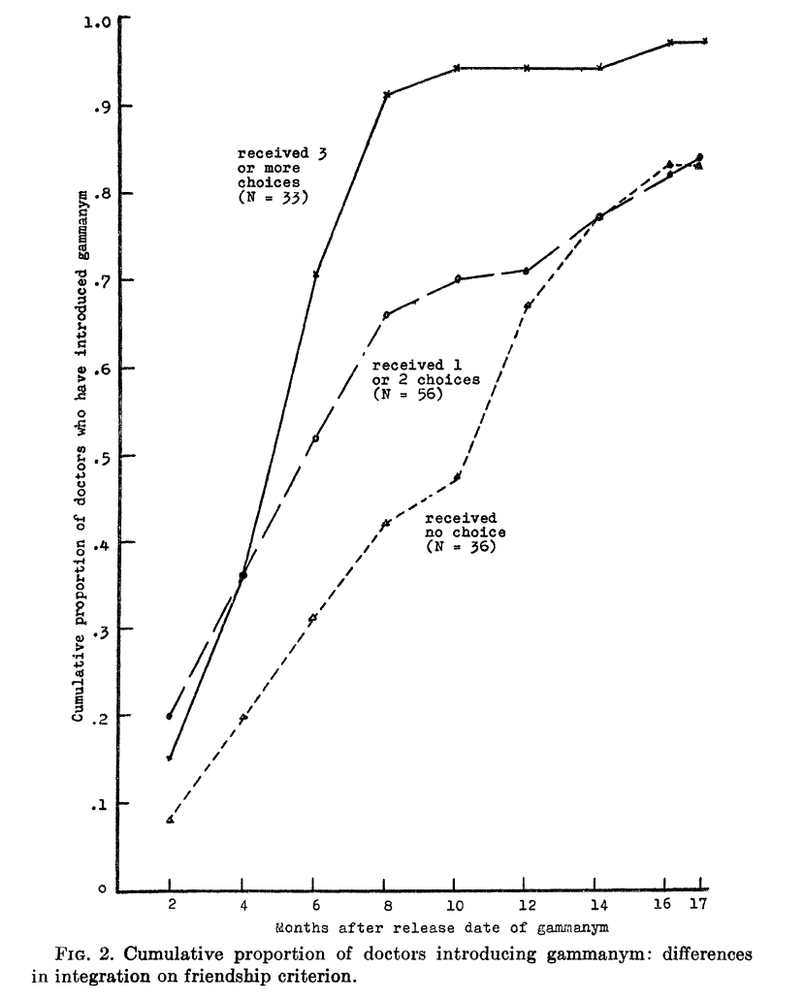
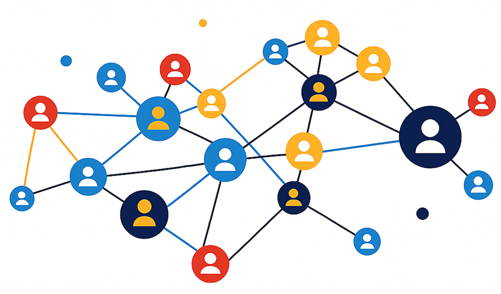
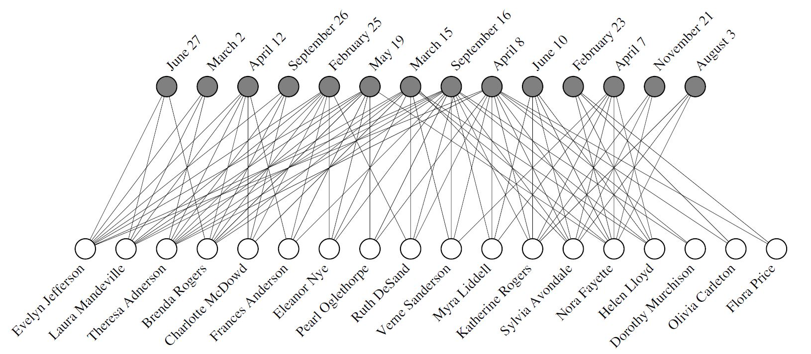
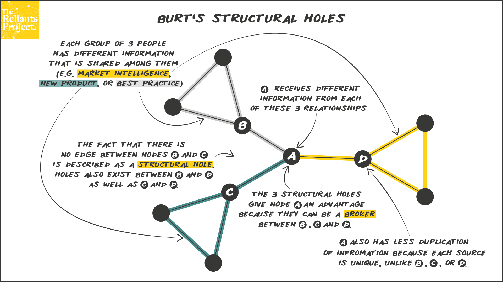
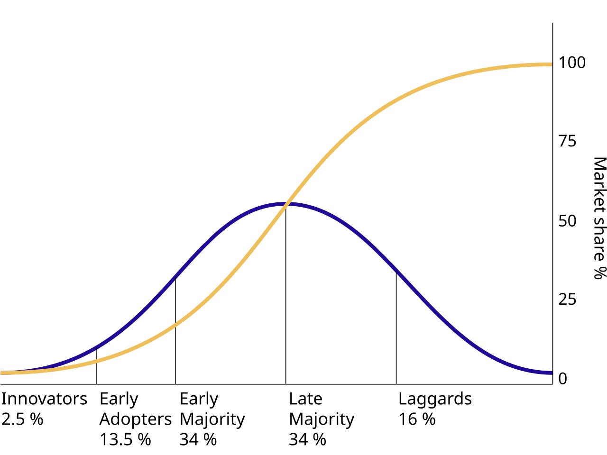
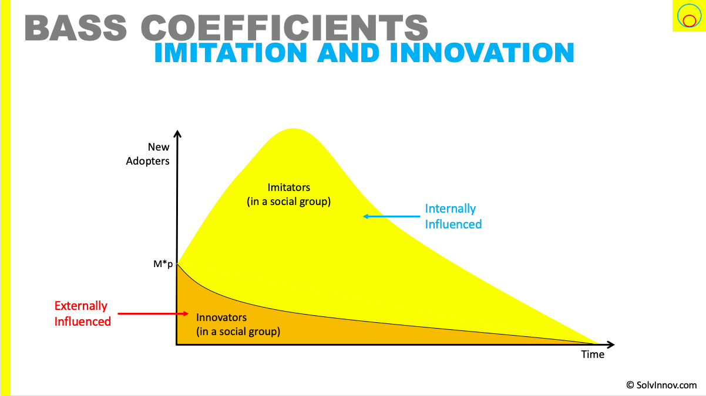

## Objectifs de la séance {#accueil}

-   Comprendre les fondements de la l'analyse de réseaux (théorie des graphes) **network science** et leur lien avec le marketing digital (WOM, adoption, engagement, rétention).
-   Lire et manipuler des graphes en R avec `{igraph}`, `{tidygraph}`, `{ggraph}`, `{visNetwork}`, `{networkD3}`.
-   Mesurer centralités, communautés, diffusion et comprendre les stratégies de **seeding** / **influence**.
-   Construire des visualisations claires pour raconter une histoire marketing à partir d'un réseau.

```{r}
#| label: setup
#| echo: false
#| eval: true
#| message: false
#| warning: false

library(knitr)
knitr::opts_chunk$set(echo = TRUE, message = FALSE, warning = FALSE)
library(tidyverse)
library(igraph)
library(tidygraph)
library(ggraph)
library(visNetwork)
library(networkD3)
library(tidyr)
library(gt)
set.seed(123)
```

## Donnez des exemples de réseaux que vous connaissez {#warmup}

-   Quand vous ouvrez **Instagram / TikTok**, qu’est-ce qui ressemble à un **réseau** ?
-   Quand **Spotify / Netflix** vous recommande un contenu, où est le **réseau** ?
-   Dans votre vie personnelle, à quoi vous fait penser la notion de « **réseau** » ?

{fig-align="center"}

## Exemple d'application marketing {style="font-size:0.9em"}

Imaginez que vous êtes responsable marketing d’une marque de sneakers.

-   Vous voyez des **clients** qui achètent vos produits.
-   Certains recommandent la marque à leurs amis, qui achètent aussi.
-   D’autres ne recommandent rien, mais sont connectés à des clients très convaincus.

**Questions :**

-   Si vous avez 100 paires gratuites à distribuer, à qui les donner ?
-   Aux plus gros acheteurs ?
-   À ceux qui sont **au centre** d’un réseau d’amis ?
-   Aux personnes qui font le lien entre plusieurs groupes ?

## D'autres exemples marketing avec les graphes/réseaux {style="font-size:0.8em"}

| Contexte | Noeuds | Liens | Question marketing |
|------------------|------------------|------------------|------------------|
| **Réseaux sociaux** | Comptes, hashtags, vidéos | *Follow*, mention, partage, co-occurrence | Qui influence qui au global ? |
| **E-commerce** | Produits, clients | Co-achat (*bundle*), clics successifs | Que recommander à qui ? |
| **Parrainage** *(Referral)* | Parrains, filleuls | Parrain $\to$ Filleul | Quels clients ont le plus de levier viral ? |
| **Influence / Marque** | Influenceurs, Créateurs | Collaboration, audience partagée, mentions | Quels profils activer pour lancer mon nouveau produit ? |

::: callout-tip
### Le défi de la marque : le *Seeding*

Dans le cas de l'influence, la marque cherche à résoudre un problème d'optimisation : « Si je ne peux payer que 5 influenceurs (les *seeds*), lesquels choisir pour toucher le maximum de cibles uniques (le *reach*) sans payer pour des audiences qui se chevauchent (*overlap*) ?
»
:::

# Partie 1 : Pourquoi les réseaux ? {.transition-slide-ubdblue}

## Influence réelle ou illusion marketing ? Le cas Tétracycline {style="font-size:0.6em"}

:::::: columns
::: {.column width="55%"}
{fig-align="center" width="80%"}
:::

:::: {.column width="45%"}
### 1. Le mythe : la contagion (1957)

@colemanDiffusionInnovationPhysicians1957 observent les courbes ci-contre.

-   **Le constat :** les médecins « connectés » (courbe du haut) adoptent le médicament beaucoup plus vite que les isolés (courbe du bas).
-   **L'interprétation :** c'est une preuve de l'**influence sociale** (effet boule de neige) qui permet de réduire l'incertitude face à la nouveauté.

### 2. La réalité : le marketing (2001)

\

@vandenbulteMedicalInnovationRevisited2001 réanalysent les données quarante ans plus tard.

\

-   **La variable oubliée :** l'effort marketing. Le laboratoire ciblait prioritairement les médecins « connectés » avec plus de publicité et de visites.
-   **La correction :** une fois la pression commerciale incluse dans le modèle, l'effet de contagion **disparaît totalement**.

::: callout-important
### Revue critique

Une belle courbe en S n'est pas toujours une preuve d'influence sociale.
Sans contrôler les variables externes, on risque de confondre **viralité** et **réaction simultanée à une campagne publicitaire**.
:::
::::
::::::

## Ce que change l'analyse de réseaux (SNA)

-   L'analyse relationnelle observe les **liens** (qui influence qui) plutôt que les seuls attributs individuels [@EncyclopediaSocialNetworks; @beauguitteLanalyseReseauSciences].
-   Un réseau = acteurs (**noeuds**) + relations (**arêtes**) ; la structure conditionne les flux d'information, l'adoption, la confiance.
-   En marketing, relier **structure → comportement → KPI** permet d'anticiper WOM, adoption, rétention ou churn.

## Marketing digital : un contexte d'« économie de réseau »

-   @achrolMarketingNetworkEconomy : passage des organisations hiérarchiques à des **alliances / plateformes** ; le marketing devient **infomédiaire** (orchestrer données clients, partenaires, communautés).

\

-   Les plateformes sociales rendent visibles les graphes de **conversation** (hashtags, mentions), de **recommandation** et de **transaction**.

\

-   Les effets de réseau (directs / indirects) et le multi-homing imposent de raisonner en termes de **position** et de **flux** plutôt qu'en silo.

## Acteurs, liens et types de réseaux

-   **Noeuds** : personnes, marques, produits, contenus, points de vente.
-   **Liens** : follow, mention, achat, clic après exposition, recommandation, co-présence.
-   Typologies : orienté vs non orienté ; pondéré (fréquence / intensité / récence) ; **bipartite** (clients ↔ produits, marques ↔ créateurs) ; **multiplex** (plusieurs types de liens).
-   Représentation : edge list, matrice d'adjacence / d'incidence, formats GEXF, GraphML, JSON node-link.

# Partie 2 : les lois universelles des réseaux {.transition-slide-ubdblue}

## L'expérience du « petit monde » (small world) : protocole et résultats {style="font-size:0.85em"}

**L'objectif** : mesurer la "distance" sociale moyenne entre deux inconnus aux États-Unis.

-   **Le protocole (Nebraska** $\to$ Boston)
    -   296 participants (« sources ») doivent faire parvenir un dossier à un agent de change (cible).
    -   **Contrainte** : transmission du dossier uniquement par **courrier** à une connaissance personnelle (prénom) susceptible d'être plus proche de la cible.
-   **Les résultats (les "6 degrés")**
    -   64 dossiers arrivent à destination (29 % de succès).
    -   Nombre moyen d'intermédiaires : **5,2**.
-   **Idée principale : le "funneling" (entonnoir)**
    -   Les chaînes convergent massivement vers la fin.
    -   48 % des dossiers finaux ont été remis à la cible par seulement **3 personnes**.
    -   **Conclusion** : le monde est « petit » grâce à quelques **connecteurs clés**.

## La force des liens faibles : analyse structurelle {style="font-size:0.85em"}

**La question** : comment l'information (ex. : trouver un emploi) circule-t-elle vraiment ?

-   **Le paradoxe des liens forts** (amis proches, famille)
    -   Ils tendent à la **transitivité** : si A est lié fortement à B et C, alors B et C sont probablement liés.
    -   Ils forment des cliques denses qui peuvent mener à une **fragmentation** globale du réseau.
-   **L'analyse structurelle : les ponts (*bridges*)**
    -   Un pont est un lien qui fournit le *seul* chemin entre deux points.
    -   Un lien fort n'est presque jamais un pont (car les amis ont des amis communs).
    -   **Seuls les liens faibles peuvent être des ponts**.
-   **Conclusion pour le marketing**
    -   **Liens faibles** $\to$ indispensables à la **diffusion** de l'information et aux opportunités.
    -   **Liens forts** $\to$ indispensables à la **cohésion** locale.

## L'émergence des réseaux sans échelle (*scale-free*) {style="font-size:0.85em"}

**Le constat** : les modèles aléatoires classiques (distribution en cloche) échouent à décrire les grands réseaux réels (Web, citations).

-   **L'analyse des données réelles (loi de puissance)**
    -   La probabilité qu'un nœud ait $k$ liens suit une loi de puissance : $P(k) \sim k^{-\gamma}$.
    -   Conséquence : le réseau est dominé par une minorité de nœuds très connectés (**hubs**).
-   **Le mécanisme générateur proposé**
    -   **1. Croissance** : le réseau n'est pas fixe, il s'étend continuellement par l'ajout de nouveaux nœuds.
    -   **2. Attachement préférentiel** (*rich-gets-richer*) : les nouveaux nœuds se connectent de préférence aux sites déjà très connectés.
-   **Conclusion**
    -   Les grands réseaux s'auto-organisent naturellement vers un état **invariant d'échelle** (*scale-free state*).

## L'évolution de la performance réseau : la méta-analyse [@nezamiNetworkCentralityFirm2025] {style="font-size:0.75em"}

**Le contexte de l'étude**

-   Une méta-analyse massive portant sur 147 études (2000-2022).
-   **Objectif** : examiner le lien entre la centralité d'une entreprise et sa performance (financière ou innovation).

**Résultats et tendances temporelles**

-   **Déclin de la quantité**
    -   L'impact des centralités de degré, de proximité (*closeness*) et d'intermédiarité (*betweenness*) diminue avec le temps.
    -   Raison : les avancées technologiques démocratisent l'accès à l'information, même pour les périphériques.
-   **Montée de la qualité**
    -   Seule la centralité de vecteur propre (*eigenvector*) voit sa relation avec la performance se renforcer.
    -   Ce qui compte désormais, c'est la **qualité des connexions** avec des partenaires influents.

**Conclusion**

-   L'avantage concurrentiel ne réside plus dans le simple accès ou le contrôle des flux (*gatekeeping*).
-   Il réside dans la capacité à bâtir des liens stratégiques avec des acteurs clés (statut et capital social).

::: callout-tip
### Quelle décision marketing prendre ?

-   Privilégier les **partenariats de qualité** avec quelques acteurs centraux plutôt que multiplier les collaborations superficielles.
-   En influence, privilégier les profils **bien connectés à d’autres leaders** plutôt que les comptes juste très “gros”.
:::

## Pour aller plus loin : les lois de l'attraction sociale {style="font-size:0.8em"}

Une vidéo de référence (Fouloscopie) qui illustre la formation des **hubs** (loi de puissance), le **clustering** et l'**homophilie**.

<center>

<iframe width="800" height="450" src="https://www.youtube.com/embed/hmo2uQbpdbI" title="YouTube video player" frameborder="0" allow="accelerometer; autoplay; clipboard-write; encrypted-media; gyroscope; picture-in-picture" allowfullscreen>

</iframe>

</center>

> *Si la vidéo ne s'affiche pas, lien direct : [Fouloscopie - Les 3 lois de L'ATTRACTION SOCIALE](https://www.youtube.com/watch?v=hmo2uQbpdbI)*

## Que dit la recherche en marketing sur les réseaux ? {style="font-size:0.5em"}

| Thème | Article | Insight (La réalité vs le mythe) | Action marketing |
|:-----------------|:-----------------|:-----------------|:-----------------|
| **1. La structure** | @katonaNetworkEffectsPersonal2011 | **Densité \> Volume**. Ce n'est pas le nombre d'amis qui compte, mais le *clustering* (amis connectés entre eux). | Ne visez pas des stars isolées, visez des **grappes denses** pour crédibiliser le message. |
| **2. La cible** | @iyengarOpinionLeadershipSocial2011a | **Réel \> Déclaré**. Les leaders qui *disent* l'être (sondages) le sont rarement dans les faits (sociométrie). | Arrêtez le déclaratif. Identifiez les hubs via la **donnée comportementale** (qui suit qui ?). |
| **3. Le produit** | @wangModelingChoiceInterdependence2013 | **Contexte \> Universel**. Produit Tech/Risqué $\to$ besoin d'**Expert**. Produit Mode $\to$ besoin de **Populaire**. | Adaptez le profil de l'influenceur à la **nature du risque** perçu par le client. |
| **4. Le timing** | @iyengarSocialContagionNew2015 | **Dynamique \> Statique**. L'influence change : *Informationnelle* au début (Essai), *Normative* ensuite (Rétention). | Changez de levier dans le temps : **Experts** pour acquérir, **Proches** pour retenir. |
| **5. L'optimisation** | @chenUncoveringImportanceRelationship2017 | **Pondéré \> Binaire**. Tous les liens ne se valent pas. La récence et l'intensité du lien sont prédictifs. | **Pondérez les arêtes** du graphe (intensité/temps) pour doubler l'efficacité du *seeding*. |

::: callout-tip
**En résumé**

-   La **structure locale** (clustering) compte plus que le nombre brut d’amis.
-   Le **leader réel** n’est pas celui qui se déclare influent.
-   Le **type de produit** détermine s’il faut un expert ou un populaire.
-   La **nature de l’influence** change dans le temps (info → norme).
-   Tous les liens ne se valent pas : intensité & récence sont clés.
:::

# Partie 3 : Bases et notations {.transition-slide-ubdblue}

## Vocabulaire d'un graphe

::::: columns
::: {.column width="40%"}

:::

::: {.column width="60%"}
-   **Sommets** ou **noeuds** (*vertices* / *nodes*) : les points du graphe représentant les entités (personnes, villes, pages web...).

-   **Arêtes** ou **liens** (*edges* / *links*) : les lignes reliant les sommets qui matérialisent une relation ou une connexion.

-   **Pondération** ou **poids** (*weight*) : la valeur associée à une arête pour quantifier la relation (distance en km, fréquence des échanges, débit...).
:::
:::::

## La direction des relations {style="font-size:0.6em"}

::::: columns
::: {.column width="50%"}
### Graphe non orienté *(undirected graph)*

-   **Concept** : la relation est symétrique ou réciproque.
-   **Visuel** : un trait simple (—).
-   **Exemple** : une connexion physique par câble ou être « amis » sur Facebook.

```{r}
#| echo: false
#| eval: true
#| fig-height: 5
#| fig-width: 5
#| fig-align: center
#| dpi: 300

library(igraph)
par(mar=c(0,0,0,0)) # Enlève les marges blanches

# Création d'un petit graphe non orienté
g_undir <- graph_from_literal(Alice-Bob, Bob-Claire, Claire-Alice, Bob-David)

plot(g_undir, 
     vertex.size = 40, 
     vertex.color = "#69b3a2",      # Vert d'eau doux
     vertex.label.color = "white", 
     vertex.frame.color = NA,
     edge.width = 3, 
     edge.color = "darkgrey",
     layout = layout_with_fr)
```
:::

::: {.column width="50%"}
### Graphe orienté *(directed graph)*

-   **Concept** : la relation a une direction spécifique.
-   **Visuel** : une flèche (→).
-   **Exemple** : un follower sur Twitter ou une recommandation de produit.

```{r}
#| echo: false
#| eval: true
#| fig-height: 5
#| fig-width: 5
#| fig-align: center
#| dpi: 300

par(mar=c(0,0,0,0)) # Enlève les marges blanches

# Création d'un graphe orienté (flèche -+)
g_dir <- graph_from_literal(Alice-+Bob, Claire-+Bob, Bob-+David, David-+Alice)

plot(g_dir, 
     vertex.size = 40, 
     vertex.color = "#404080",      # Bleu strict
     vertex.label.color = "white",
     vertex.frame.color = NA,
     edge.width = 2, 
     edge.arrow.size = 0.8,         # Taille de la flèche
     edge.color = "black",
     layout = layout_with_fr)
```
:::
:::::

## Définition formelle {style="font-size:0.8em"}

$$G = (V, E)$$

En mathématiques (et dans `igraph`), le graphe $G$ est un couple composé de deux ensembles :

**1. L'ensemble des sommets (**$V$ comme *Vertices*) : c'est la liste des acteurs.
$$V = \{Alice, Bob, Claire, David\}$$

**2. L'ensemble des arêtes (**$E$ comme *Edges*) : c'est la liste des couples connectés.
Pour ton exemple orienté, cela s'écrit comme des couples ordonnés $(Source, Cible)$ :

$$E = \{(Alice, Bob), (Claire, Bob), (Bob, David), (David, Alice)\}$$

::: callout-important
### Pourquoi cette notation est importante ?

Cette notation peut être utilisée en R pour créer des graphes (slide suivante)
:::

## Exemple de code R

```{r}
#| echo: true
#| eval: true

# 1. On définit G (Alice vers Bob, etc.)
g <- graph_from_literal( Alice-+Bob, Claire-+Bob, Bob-+David, David-+Alice )

# 2. On interroge V (Vertices)
cat("--- L'ensemble V (les sommets) ---\n")
V(g)

# 3. On interroge E (Edges)
cat("\n--- L'ensemble E (les arêtes) ---\n")
E(g)
```

## Comment l'ordinateur stocke le graphe ? {style="font-size:0.7em"}

::::::: columns
::: {.column width="40%"}
```{r}
#| echo: false
#| eval: true
#| fig-height: 7
#| fig-width: 5
#| dpi: 300
#| fig-align: center

plot(g_dir, 
     vertex.size = 40, 
     vertex.color = "#404080",      # Bleu strict
     vertex.label.color = "white",
     vertex.frame.color = NA,
     edge.width = 2, 
     edge.arrow.size = 0.8,         # Taille de la flèche
     edge.color = "black",
     layout = layout_with_fr)
```
:::

::::: {.column width="60%"}
### 1. La Matrice d'Adjacence *format mathématique (matrice)*

On lit : **ligne** (source) $\to$ **Colonne** (cible).

\

::: {style="display: flex; justify-content: center;"}
| $\downarrow$/$\rightarrow$ | **A** | **B** | **C** | **D** |
|:--------------------------:|:-----:|:-----:|:-----:|:-----:|
|         **A**lice          |   0   | **1** |   0   |   0   |
|          **B**ob           |   0   |   0   |   0   | **1** |
|         **C**laire         |   0   | **1** |   0   |   0   |
|         **D**avid          | **1** |   0   |   0   |   0   |
:::

<center><small>*Lecture : Claire (ligne C) met un 1 dans la colonne de Bob (B). Elle le suit*</small></center>

\
\

### 2. La Liste d'arêtes : *format fichier (Excel / CSV)*

\

C'est simplement la liste des "1" de la matrice, format le plus courant.

\

::: {style="display: flex; justify-content: center;"}
| Source | Target |
|--------|--------|
| Alice  | Bob    |
| Claire | Bob    |
| Bob    | David  |
| David  | Alice  |
:::
:::::
:::::::

## Zoom sur la Matrice d'Incidence ($M_{inc}$) {style="font-size:0.7em"}

:::::: columns
::: {.column width="40%"}
```{r}
#| echo: false
#| eval: true
#| fig-height: 9
#| fig-width: 6
#| dpi: 300
#| fig-align: center

plot(g_dir, 
     vertex.size = 40, 
     vertex.color = "#404080",      # Bleu strict
     vertex.label.color = "white",
     vertex.frame.color = NA,
     edge.width = 2, 
     edge.arrow.size = 0.8,         # Taille de la flèche
     edge.color = "black",
     layout = layout_with_fr)
```
:::

:::: {.column width="60%"}
**La logique :** au lieu de dire "qui connaît qui", on regarde **"qui participe à quoi"**.
Les colonnes ne sont plus des personnes, mais des **événements** ou des **liens** ($e_1, e_2...$).

\

::: {style="display: flex; justify-content: center;"}
|   | $e_1$ <br><small>(Lien A-B)</small> | $e_2$ <br><small>(Lien C-B)</small> | $e_3$ <br><small>(Lien B-D)</small> | $e_4$ <br><small>(Lien D-A)</small> |
|:--------------|:-------------:|:-------------:|:-------------:|:-------------:|
| **A**lice | **1** | 0 | 0 | **1** |
| **B**ob | **1** | **1** | **1** | 0 |
| **C**laire | 0 | **1** | 0 | 0 |
| **D**avid | 0 | 0 | **1** | **1** |
:::

\

**Lecture (Colonne** $e_1$) : Alice (1) et Bob (1) sont les deux acteurs impliqués dans la relation n°1.

\
\

**Pourquoi utiliser ce format compliqué ?** : c'est le format idéal pour le Marketing (graphes bipartis) :

\

1.  Imaginez que les **colonnes sont des Produits**.
2.  Imaginez que les **lignes sont des Clients**.
3.  Si Alice et Bob ont un "1" dans la même colonne, ils ont acheté le même produit !
::::
::::::

## Construire un graphe minimal en R depuis un dataframe

:::::: columns
::: {.column width="40%" style="font-size:0.5em"}
```{r}
#| label: igraph-minimal
#| fig-align: center
#| fig-dpi: 300
#| fig-width: 5.9

edges <- data.frame(
  from = c("Alice", "Alice", "Bob", "Claire", "David", "Eva"),
  to   = c("Bob", "Claire", "David", "Eva", "Alice", "Bob"),
  weight = c(3, 1, 2, 1, 1, 4)
)
g <- graph_from_data_frame(edges, directed = TRUE)
plot(g, 
     edge.arrow.size = 1, vertex.size = 30, vertex.color = "steelblue", vertex.label.color = "white",
     edge.width = E(g)$weight,      # L'épaisseur dépend du poids
     edge.label = E(g)$weight       # On affiche le chiffre pour la pédagogie
)
```
:::

:::: {.column width="60%" style="font-size:0.65em"}
::: callout-note
### Pourquoi pondérer les liens ?

Se limiter à un graphe binaire (relation présente ou absente) est souvent trop simpliste.
La **pondération** permet de qualifier la valeur réelle de la relation :

1.  **L'intensité** : elle se mesure par la fréquence des échanges, le nombre de « likes » ou le montant des transactions. *Un lien fort véhicule l'influence bien plus efficacement qu'un lien faible*.
2.  **La récence** : un échange survenu hier a une valeur prédictive supérieure à une connexion datant d'il y a cinq ans. *L'influence sociale a tendance à s'éroder avec le temps*.
3.  **Le volume d'activité** : dans certains secteurs (comme le B2B ou la santé), un « gros utilisateur » (*heavy user*) exerce souvent un impact disproportionné par rapport à un utilisateur occasionnel.

**Conséquence stratégique** : ignorer ces poids risque de fausser le ciblage.
Un noeud ayant peu de liens, mais très intenses et récents, est souvent un levier d'influence bien plus puissant qu'un noeud très connecté mais aux relations superficielles ou inactives.
:::
::::
::::::

## Visualiser et styliser {style="font-size:0.75em"}

```{r}
#| label: ggraph-basic
#| output-location: slide
tbl <- tbl_graph(edges = edges, directed = TRUE)

tbl_undirected <- tbl |>
  convert(to_undirected)

tbl_undirected |>
  activate(nodes) |>
  mutate(
    deg = centrality_degree(mode = "all"),
    community = as.factor(group_louvain())
  ) |>
  ggraph(layout = "fr") +
  geom_edge_link(aes(width = weight), alpha = 0.4, colour = "grey40") +
  geom_node_point(aes(size = deg, fill = community), shape = 21, colour = "grey15") +
  geom_node_text(aes(label = name), repel = TRUE, size = 4) +
  scale_edge_width(range = c(0.5, 2)) +
  theme_void()
```

::: callout-note
### Packages utiles

-   `{igraph}` : structures et mesures.
-   `{tidygraph}` : pipeline `dplyr` pour réseaux.
-   `{ggraph}` : grammaire de la viz de graphes.
-   `{visNetwork}` / `{networkD3}` : interactif HTML (force-directed).
:::

## Interactif : `{networkD3}` (ne gère pas les graphes orientés)

```{r}
#| label: networkd3-example

networkD3::simpleNetwork(
  edges |> select(Source = from, Target = to),
  fontSize = 14, opacity = 0.9, linkColour = "#999999"
)
```

## Interactif : un exemple connu [@zacharyInformationFlowModel1977] {style="font-size:0.6em"}

```{r}
#| label: karate-example
karate_edgelist <- read.csv("https://ona-book.org/data/karate.csv")
# création du graphe igraph à partir de l’edgelist (non orienté)
g <- igraph::graph_from_data_frame(karate_edgelist, directed = FALSE)
# tidygraph à partir du graphe igraph
tbl_undirected <- as_tbl_graph(g)  # g est déjà non orienté
# visu interactive simple
networkD3::simpleNetwork( karate_edgelist,height = "800px", width  = "1000px",   fontSize = 14, linkDistance = 80)
```

## Interactif : `{visNetwork}` {style="font-size:0.6em"}

```{r}
#| label: visnetwork-example
#| output-location: slide

# 1. Edges pour visNetwork : colonnes from / to
edges <- data.frame(
  from = karate_edgelist$from,
  to   = karate_edgelist$to
)

# 2. Nodes pour visNetwork
nodes_vis <- data.frame(id = V(g)$name)
nodes_vis$label <- nodes_vis$id
nodes_vis$title <- nodes_vis$id

visNetwork(nodes_vis, edges, width = "100%", height = "800px") |>
  visNodes(
    shape = "dot", 
    size = 20,
    color = list(background = "steelblue", border = "black")
  ) |>
  visEdges(
    color = "#999999",
    arrows = "" ,          # graphe non orienté → pas de flèches
    smooth = TRUE
  ) |>
  visOptions(
    highlightNearest = list(enabled = TRUE, degree = 1, hover = TRUE),
    nodesIdSelection = TRUE
  ) |>
  visLayout(randomSeed = 123)
```

## Un classique fondateur : the Southern Women Study [@davisDeepSouthSocial1941] {style="font-size:0.7em"}

{fig-align="center" width="70%"}

::::: columns
::: {.column width="50%"}
### Le contexte (années 1930)

Une étude traçant 18 femmes (cercles blancs) et leur présence à 14 événements sociaux (cercles gris).

-   **Graphe biparti** : Les liens ne se font qu'entre deux types d'acteurs différents (Femmes $\leftrightarrow$ Événements).
-   **Centralité** : On repère vite les "leaders" visuellement (celles avec le plus de lignes, ex: Evelyn ou Theresa).
:::

::: {.column width="50%"}
**Cliques & structure** : l'enchevêtrement des lignes révèle visuellement l'existence de deux groupes sociaux distincts au sein de la population.
:::
:::::

# Partie 3 : Mesures structurantes {.transition-slide-ubdblue}

## Taille, densité, composantes

-   **Taille** : \\(\|V\|\\) noeuds, \\(\|E\|\\) arêtes.
-   **Densité** \\(= \\frac{\|E\|}{\|V\|(\|V\|-1)}\\) (orienté) ou \\(\\frac{2\|E\|}{\|V\|(\|V\|-1)}\\) (non orienté).
-   **Composantes** : isoler les sous-ensembles connectés (utile pour l'audience atteignable).
-   **Diamètre** : distance max entre deux noeuds d'une composante.

```{r}
#| label: metrics-size
edge_density(g)                 # densité du karate club
components(g)$csize             # tailles des composantes
diameter(g, directed = FALSE, weights = NA)
```

## Degrés {style="font-size:0.8em"}

-   **Degré** = nombre de liens d'un noeud (entrant / sortant en orienté).
-   **Distribution des degrés** : souvent asymétrique (loi de puissance, présence de hubs).
-   **Assortativité / homophilie** : tendance à se lier à des semblables (âge, lieu, classe sociale, produit préféré).
-   Implication marketing : **hubs** attirent l'attention mais les **ponts faibles** (Granovetter) diffusent à d'autres communautés.

```{r}
#| label: degree-dist
# degrés (non orienté → mode = "all")
degree(g, mode = "all")
# Pour l’exemple d’assortativité, on fabrique un segment factice si besoin
V(g)$segment <- sample(c("A", "B"), vcount(g), replace = TRUE)
assortativity_nominal(g, types = as.factor(V(g)$segment), directed = FALSE)
```

## Distribution

```{r}
#| label: degree-hist
#| output-location: slide
#| fig-dpi: 300
# 1. Degrés du graphe karate (non orienté)
deg <- degree(g)

# 2. Plot discret avec ggplot2
ggplot(data.frame(deg = deg), aes(x = factor(deg))) +
  geom_bar(fill = "skyblue", color = "white") +
  labs(
    title = "Distribution des degrés (Karate Club)",
    x = "Degré",
    y = "Fréquence"
  ) +
  theme_minimal()
```

## Clustering & triangles

-   **Coefficient de clustering local** : probabilité que deux voisins d'un noeud soient connectés.
-   Mesure la **fermeture triadique** (recommandations par amis communs).
-   Marketing : forte fermeture = effet de niche, faible fermeture = ouverture vers de nouveaux segments.

```{r}
#| label: clustering
transitivity(g, type = "localaverage") # moyenne locale
```

## Centralités essentielles

-   **Centralité de degré** : visibilité brute.
-   **Betweenness** : noeud sur de nombreux plus courts chemins (ponts, brokers, leaders d'opinion).
-   **Closeness** : proximité moyenne aux autres (rapidité d'accès à l'information).
-   **Eigenvector / PageRank** : être connecté à des noeuds eux-mêmes importants (autorité).
-   **k-core** : noyau dense (early adopters robustes).

```{r}
#| label: centrality-basic
V(g)$degree <- degree(g, mode = "all")
V(g)$btw    <- betweenness(g, directed = TRUE)
V(g)$pr     <- page_rank(g)$vector
head(data.frame(name = V(g)$name, degree = V(g)$degree, btw = V(g)$btw, pr = V(g)$pr))
```

::: callout-important
### Comment choisir une centralité ?

-   **Seeding** : degré ou k-core si contagion simple, betweenness pour passer entre communautés.
-   **Support client** : closeness pour couvrir vite un cluster d'utilisateurs.
-   **Brand safety** : PageRank/authority pour crédibilité des sources.
:::

## Trous structuraux : contexte & données [@burtStructuralHolesGood2004] {style="font-size:0.70em"}

### Contexte

-   Article clé : **“Structural Holes and Good Ideas”** (AJS, 2004).
-   Entreprise américaine (électronique), **plusieurs centaines de managers**.
-   Question : *quelles positions génèrent les “bonnes idées” ?*

### Données & réseau d’information

-   Pour chaque manager : enquête sur les **discussions de travail / problèmes / idées**.
-   Construction d’un **ego-network complet**

### Deux dimensions mesurées

-   **Closure** : densité / redondance entre alters.
-   **Contrainte** : mesure des **trous structuraux**.

### Lecture

-   **Contrainte élevée** → réseau fermé → information redondante.
-   **Contrainte faible** → ego relie des alters non connectés → **trous structuraux** → info non redondante.

::: callout-note
Un **trou structural** = un lien manquant entre deux alters.\
Le manager qui les connecte devient un **broker** : combine infos que personne d’autre ne relie.
:::

## Comment Burt mesure les “bonnes idées” ? {style="font-size:0.78em"}

### trois sources croisées

1.  **Idées rapportées** par les managers :
    -   propositions, projets, innovations soumises.
2.  **Évaluation externe** par supérieurs / pairs :
    -   utilité, originalité, application concrète.
3.  **Indicateurs de carrière** :
    -   rémunération,
    -   promotions obtenues,
    -   évaluations annuelles.

### Pourquoi cette triangulation ?

-   Évite le biais du “je crois avoir une bonne idée”.
-   Mesure **production + reconnaissance + impact organisationnel**.
-   Permet d’évaluer si la **position dans le réseau** prédit réellement la valeur produite.

## Résultats & implications marketing {style="font-size:0.78em"}

### Résultats clés

-   Faible contrainte (beaucoup de **trous structuraux**) → managers :
    -   produisent **plus d’idées nouvelles**,
    -   voient leurs idées **moins rejetées**,
    -   ont **plus d’idées reconnues** comme utiles,
    -   progressent davantage (salaire, promotions).
-   Forte closure (réseau fermé) → informations **redondantes**, peu d’innovation.

### Théorie : pourquoi ça marche ?

-   Le broker combine des **fragments d’information** provenant de **mondes différents**.
-   Innovation = **recombinaison** de connaissances non connectées.

::: callout-tip
### À retenir

-   Valeur = **info non redondante**.\
-   Brokers = **meilleures idées + meilleur impact**.\
-   En marketing : viser ceux qui **connectent des mondes**, pas seulement les plus gros hubs.
:::

## Illustration Burt



## k-core et trous structuraux

-   **k-core** : sous-graphe où chaque noeud a degré ≥ *k* → noyau engagé.
-   **Trous structuraux** (Burt) : acteurs reliant des clusters éloignés, générant arbitrage d'information.
-   Marketing : micro-influenceurs de niche peuvent être des brokers très efficaces.

```{r}
#| label: kcore
coreness(g)
```

## Ego-network (zoom local)

```{r}
#| label: ego-network
ego_alice <- induced_subgraph(g, ego(g, order = 1, nodes = "Mr Hi")[[1]])
plot(ego_alice, vertex.color = "tomato", edge.arrow.size = 0.5)
```

## Cas appliqué : réseau de Friends (centralités) {style="font-size:0.78em"}

```{r}
#| label: friends-load
#| output-location: slide
edges_friends <- readr::read_csv("../data_full/friends/friends_full_series_edgelist.csv")

g_friends <- igraph::graph_from_data_frame(
  edges_friends,
  directed = FALSE
) |>
  igraph::simplify(remove.loops = TRUE, edge.attr.comb = list(weight = "sum", "ignore"))

V(g_friends)$degree     <- igraph::degree(g_friends)
V(g_friends)$betweenness <- igraph::betweenness(g_friends)
V(g_friends)$coreness    <- igraph::coreness(g_friends)

friends_deg_core <- tibble::tibble(
  name     = V(g_friends)$name,
  degree   = V(g_friends)$degree,
  coreness = V(g_friends)$coreness
) |>
  dplyr::arrange(dplyr::desc(degree)) |>
  dplyr::slice_head(n = 10)

friends_deg_core |>
  gt() |>
  fmt_number(
    columns = c(degree, coreness),
    decimals = 0,
    use_seps = TRUE
  ) |>
  tab_header(
    title = md("**Centralité et noyau k-core dans le réseau _Friends_**"),
    subtitle = md("Top 10 personnages par **degré** (nombre de connexions) et leur appartenance au **k-core**.")
  ) |>
  cols_label(
    name     = md("**Personnage**"),
    degree   = md("**Degré**<br><span style='font-weight:400;'>Nb de voisins</span>"),
    coreness = md("**k-core**<br><span style='font-weight:400;'>Noyau du réseau</span>")
  ) |>
  tab_style(
    style = list(
      cell_fill(color = "#f0f2f5"),
      cell_text(weight = "bold")
    ),
    locations = cells_column_labels(everything())
  ) |>
  opt_table_outline() |>
  opt_row_striping() |>
  tab_options(
    table.font.size = px(14),
    heading.align = "center"
  ) |>
  tab_source_note(
    md("Ce tableau montre les **personnages les plus connectés** du réseau, ainsi que le **noyau k-core** auquel ils appartiennent (cœur structurel du graphe).")
  )
```

## Cas appliqué : Friends & trous structuraux (Burt) {style="font-size:0.78em"}

```{r}
#| label: friends-burt
#| output-location: slide

g_friends <- igraph::graph_from_data_frame(
  edges_friends,
  directed = FALSE
) |>
  igraph::simplify(remove.loops = TRUE, edge.attr.comb = list(weight = "sum", "ignore"))

V(g_friends)$degree     <- igraph::degree(g_friends)
V(g_friends)$constraint <- igraph::constraint(g_friends)

burt_df <- tibble::tibble(
  name       = V(g_friends)$name,
  degree     = V(g_friends)$degree,
  constraint = V(g_friends)$constraint
)

friends_burt_top <- burt_df |>
  dplyr::arrange(constraint) |>
  dplyr::slice_head(n = 10)

friends_burt_top |>
  gt() |>
  fmt_number(
    columns = degree,
    decimals = 0,
    use_seps = TRUE
  ) |>
  fmt_number(
    columns = constraint,
    decimals = 3
  ) |>
  tab_header(
    title = md("**Personnages en position de trou structural (_Friends_)**"),
    subtitle = md("Les 10 personnages avec la **plus faible contrainte de Burt** : ce sont ceux qui relient des groupes peu connectés entre eux (rôles de **brokers**).")
  ) |>
  cols_label(
    name       = md("**Personnage**"),
    degree     = md("**Degré**"),
    constraint = md("**Contrainte de Burt**<br><span style='font-weight:400;'>Plus c’est faible, plus la position est “broker”</span>")
  ) |>
  tab_style(
    style = list(
      cell_fill(color = "#f0f2f5"),
      cell_text(weight = "bold")
    ),
    locations = cells_column_labels(everything())
  ) |>
  opt_table_outline() |>
  opt_row_striping() |>
  tab_options(
    table.font.size = px(14),
    heading.align = "center"
  ) |>
  tab_source_note(
    md("Ce tableau met en évidence les **acteurs en position de trou structural** : ils connectent des parties du réseau peu reliées et accèdent à une **information moins redondante**.")
  )


```

## Ego-network de “Bandleader” (Friends)

```{r}
#| label: ego-banleader-friends-burt
#| output-location: slide

g_friends_tbl <- as_tbl_graph(g_friends)

# choisir un broker, ex. "Bandleader"
ego_broker <- ego(g_friends, order = 1, nodes = "Bandleader")[[1]]
g_ego <- induced_subgraph(g_friends, ego_broker)

as_tbl_graph(g_ego) |>
  ggraph(layout = "fr") +
  geom_edge_link(alpha = 0.3) +
  geom_node_point(size = 4) +
  geom_node_text(aes(label = name), repel = TRUE, size = 3) +
  theme_void()

```

## Distances et efficacité

-   **Distance** = plus court chemin entre deux noeuds.
-   **Longueur de chemin moyenne** : accessibilité globale.
-   **Efficacité** : inverse de la distance (utile si composantes multiples).
-   **Diamètre** vs **rayon** : robustesse / vulnérabilité.

```{r}
#| label: distance
mean_distance(as.undirected(g))
d <- distances(g, mode = "all")
1 / mean(d[is.finite(d)])  # efficacité moyenne approximative
```

# Partie 4 : Communautés {.transition-slide-ubdblue}

## Détecter les communautés

-   **Girvan-Newman** : supprime arêtes à forte betweenness.
-   **Louvain / Leiden** : maximise la **modularité** \\(Q\\) (densité interne - densité attendue).
-   **Walktrap / Infomap** : marche aléatoire, flux d'information.
-   Marketing : découvrir des tribus (affinités marques, styles de contenu, intérêts).

```{r}
#| label: community-detect
comm <- cluster_louvain(as.undirected(g))
membership(comm)[1:5]
modularity(comm)
```

## Visualiser les communautés {style="font-size:0.7em"}

```{r}
#| label: community-viz
tbl_undirected |>
  activate(nodes) |>
  mutate(comm = as.factor(group_louvain())) |>
  ggraph(layout = "fr") +
  geom_edge_link(alpha = 0.2, colour = "grey50") +
  geom_node_point(aes(fill = comm), size = 4, shape = 21) +
  geom_node_text(aes(label = name), repel = TRUE, size = 3) +
  theme_void()
```

::: callout-note
### Interprétation marketing

-   **Communautés de conversation** : hashtags, topics → insight pour ciblage créatif.
-   **Communautés de co-achat** : bundles produits, recommandations cross-sell.
-   **Communautés d'expérience** : utilisateurs early adopters vs mainstream.
:::

# Partie 5 : Diffusion & Influence (pour aller plus loin) {.transition-slide-ubdblue}

## Les mécanismes de la diffusion {style="font-size:1em"}

### 1. Les Fondamentaux Théoriques

-   **Sociologie/innovation [@rogersDiffusionInnovations2003]**
    -   La diffusion suit une **courbe en S**.
    -   Profils : Innovateurs $\to$ Adopteurs précoces $\to$ Majorité $\to$ Retardataires.
-   **Prévision des ventes [@bassNewProductGrowth1969]**
    -   Le modèle de **Bass** distingue deux forces :
    -   $p$ : Innovation (Pub, influence externe).
    -   $q$ : Imitation (Bouche-à-oreille, effet réseau).
-   **Algorithmes de contagion**
    -   **IC** (Independent Cascade) : probabilité de contaminer un voisin (viralité).
    -   **LT** (Linear Threshold) : adoption si la pression du groupe dépasse un seuil (norme sociale).

## Illustration Rogers

{fig-align="center" width="60%"}

## Illustration Bass



## Exporter vers Gephi / Cytoscape

```{r}
#| label: export-graph
dir.create("exports", showWarnings = FALSE)
write_graph(g, file = "exports/graph_demo.graphml", format = "graphml")
```

## Prendre en main Gephi

<center>

<iframe width="800" height="450" src="https://www.youtube.com/watch?v=GXtbL8avpik" title="YouTube video player" frameborder="0" allow="accelerometer; autoplay; clipboard-write; encrypted-media; gyroscope; picture-in-picture" allowfullscreen>

</iframe>

</center>

> *Si la vidéo ne s'affiche pas, lien direct :* [GEPHI - Introduction to Network Analysis and Visualization (Tutorial)](https://www.youtube.com/watch?v=GXtbL8avpik)

## Visualisation des graphes: conseils

-   Éviter les **graphes fouillis** : filtrer, agréger, échantillonner.
-   Utiliser la couleur pour l'information (communautés, intensité), pas pour l'esthétique seulement.
-   Donner des **légendes** (orientation, signification des tailles, poids).
-   Proposer des **vues multiples** : macro (communautés) + micro (ego-network).

## Références
